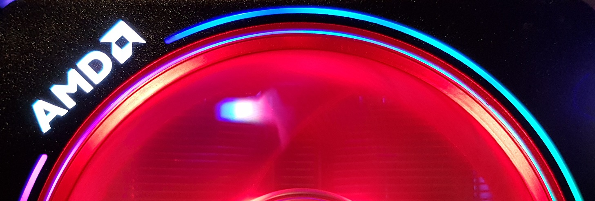

The AMD Wraith Prism stock cooler is a multi-zone RGB device manufactured for AMD by Cooler Master.  It connects to the motherboard using three connectors - a PWM fan header that runs the fan and powers the LEDs, a USB header for advanced control, and an RGB header for control of the fan color through the motherboard's RGB controller.  The USB interface allows full control of the RGB so it is the interface this information will be focused on.  It enumerates at 2516:0051 and uses USB interrupt transfers to communicate with the host software.

All messages are 64 bytes long.  There appear to be multiple packets that can be sent.

# Enable control
Send this packet to initialize the device after a power cycle or reconnect.  Should be sent once when first opening the device.

| Byte index | Value  |
| ---------- | ------ |
| 0x00       | 0x41   |
| 0x01       | 0x80   |
| 0x02 - end | 0x00   |

# Remap LEDs
This packet maps the individual LEDs to effect channels.  There seems to be some limitation on which LEDs map to which channels.  This is not fully understood.  The default values are shown for the channel map in the packet table below.

| Byte index | Value  | Description             |
| ---------- | ------ | ----------------------- |
| 0x00       | 0x51   |                         |
| 0x01       | 0xA0   |                         |
| 0x02       | 0x01   |                         |
| 0x03       | 0x00   |                         |
| 0x04       | 0x00   |                         |
| 0x05       | 0x03   |                         |
| 0x06       | 0x00   |                         |
| 0x07       | 0x00   |                         |
| 0x08       | 0x05   | Channel for Logo LED    |
| 0x09       | 0x06   | Channel for Fan LED     |
| 0x0A       | 0x07   | Channel for Ring LED 0  |
| 0x0B       | 0x07   | Channel for Ring LED 1  |
| 0x0C       | 0x07   | Channel for Ring LED 2  |
| 0x0D       | 0x07   | Channel for Ring LED 3  |
| 0x0E       | 0x07   | Channel for Ring LED 4  |
| 0x0F       | 0x07   | Channel for Ring LED 5  |
| 0x10       | 0x07   | Channel for Ring LED 6  |
| 0x11       | 0x07   | Channel for Ring LED 7  |
| 0x12       | 0x07   | Channel for Ring LED 8  |
| 0x13       | 0x07   | Channel for Ring LED 9  |
| 0x14       | 0x07   | Channel for Ring LED 10 |
| 0x15       | 0x07   | Channel for Ring LED 11 |
| 0x16       | 0x07   | Channel for Ring LED 12 |
| 0x17       | 0x07   | Channel for Ring LED 13 |
| 0x18       | 0x07   | Channel for Ring LED 14 |
| 0x19 - end | 0x00   |                         |

# Edit Effect Channel Settings
This packet edits the settings of an effect channel including mode, speed, brightness, and color.

| Byte index | Value  | Description             |
| ---------- | ------ | ----------------------- |
| 0x00       | 0x51   |                         |
| 0x01       | 0x2C   |                         |
| 0x02       | 0x01   |                         |
| 0x03       | 0x00   |                         |
| 0x04       | 0x05   | Effect channel to edit  |
| 0x05       | 0xFF   | Speed (0xFF for static) |
| 0x06       | 0x00   | Direction (0:CW, 1:CCW) |
| 0x07       | 0x01   | Mode (Fan and Logo)     |
| 0x08       | 0xFF   |                         |
| 0x09       | 0xFF   | Brightness              |
| 0x0A       | 0x00   | Red                     |
| 0x0B       | 0xFF   | Green                   |
| 0x0C       | 0x00   | Blue                    |
| 0x0D       | 0x00   |                         |
| 0x0E       | 0x00   |                         |
| 0x0F       | 0x00   |                         |
| 0x10 - end | 0xFF   |                         |

Brightness setting goes from 0x00-0xFF (0x4C, 0x99, 0xFF) in Static, Breathing, and Rainbow, 0x00-0x7F (0x10, 0x40, 0x7F) in Color Cycle.

Breathing speed settings from slow to fast: 0x3C, 0x37, 0x31, 0x2C, 0x26

Color cycle speed settings from slow to fast: 0x96, 0x8C, 0x80, 0x6E, 0x68

Rainbow speed settings from slow to fast: 0x72, 0x68, 0x64, 0x62, 0x61

Swirl and Chase speed settings from slow to fast: 0x77, 0x74, 0x6E, 0x6B, 0x67

Morse Code speed setting is fixed at 0x6B

The 0x80 bit in the Direction register sets random color mode.  Bounce mode always sets this bit.

## Effect channels
These different effect channels are mapped to the LEDs.  Effect channels 0x05 and 0x06 are special, as these are used for the fan and logo zones.

| Channel ID | Effect Description | Mode Byte |
| ---------- | ------------------ | --------- |
| 0x00       | Static             | 0xFF      |
| 0x01       | Breathing          | 0x03      |
| 0x02       | Color Cycle        | 0xFF      |
| 0x03       |                    |           |
| 0x04       |                    |           |
| 0x05       | Logo Effect        | 0xXX      |
| 0x06       | Fan Effect         | 0xXX      |
| 0x07       | Rainbow            | 0x05      |
| 0x08       | Bounce             | 0xFF      |
| 0x09       | Chase              | 0xC3      |
| 0x0A       | Swirl              | 0x4A      |
| 0x0B       | Morse Code         | 0x05      |

## Fan and Logo Modes

| Mode Byte | Mode Description |
| --------- | ---------------- |
| 0x00      |                  |
| 0x01      | Static           |
| 0x02      | Color Cycle      |
| 0x03      | Breathing        |