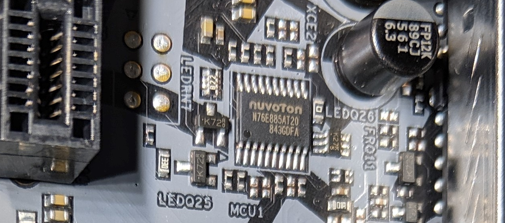

ASRock's Polychrome RGB motherboard lighting system uses a Nuvoton N76E885AT20 controller on [SMBus](SMBus-Interface-Details) that enumerates at device address 0x6A.  Information documented here comes from @EUA who did the reverse engineering work on this board.  His project can be found here:

https://github.com/EUA/AsrLed

Based on this comment: https://gitlab.com/CalcProgrammer1/OpenAuraSDK/issues/35#note_260299163, it looks like ASRock's first boards didn't actually use the Polychrome RGB branding and instead were called ASR LED.  The protocol changed slightly in the later firmware revisions, which were used on boards with the Polychrome branding.  More information can be found here:

https://github.com/RattyDAVE/asrock-leds/blob/master/NOTES.md

# ASR LED (Firmware 1.10)

## Register Addresses
Register addresses operate as multi-byte values.  Reading one byte from a register address indicates the size, in bytes, of the value it stores.  Reading additional bytes retrieves the data.  To write to a register address, a block transfer of the given size is used.

| Address | Size | Function |
| ------ | ------ | ------ |
| 0x00 | 2 | Firmware Version Major.Minor |
| 0x30 | 1 | Mode |

## Modes
To enable a mode, write the mode value to the mode register (0x30).  To set the colors and/or speed for the mode, block write 1-4 bytes to the mode's value (for instance to 0x11 for static).  The number of bytes and format of block is shown in the table below.

| Mode | Description | Bytes | Data |
| ------ | ------ | ------ | ------ |
| 0x10 | Off | 0 | No data |
| 0x11 | Static | 3 | Red, Green, Blue |
| 0x12 | Breathing | 4 | Red, Green, Blue, Speed |
| 0x13 | Strobe | 4 | Red, Green, Blue, Speed |
| 0x14 | Cycling | 4 | Red, Green, Blue, Speed |
| 0x15 | Random | 1 | Speed |
| 0x17 | Music | 3 | Red, Green, Blue |
| 0x18 | Wave | 1 | Speed |

# Polychrome RGB (Firmware 2.10(?) and 3.0)

## Register Addresses
Register addresses appear to multi-byte values.  Reading one byte from a register address indicates the size, in bytes, of the value it stores.  Reading additional bytes retrieves the data.  To write to a register address, a block transfer of the given size is used.

| Address | Size | Function |
| ------ | ------ | ------ |
| 0x00 | 2 | Firmware Version Major.Minor |
| 0x30 | 1 | Mode |
| 0x34 | 3 | Color (Red, Green, Blue) |

## Modes
To enable a mode, write the mode value to the mode register (0x30).  To set the speed for the mode, block write 1 byte to the mode's value (for instance to 0x11 for static).  To set the colors for the mode, block write 3 bytes (Red, Green, Blue) to the color register (0x34).  Cycling, random, and rainbow modes do not use the color register.

| Mode | Description | Bytes | Data |
| ------ | ------ | ------ | ------ |
| 0x10 | Off | 0 | No data |
| 0x11 | Static | 0 | No data |
| 0x12 | Breathing | 1 | Speed |
| 0x13 | Strobe | 1 | Speed |
| 0x14 | Cycling | 1 | Speed |
| 0x15 | Random | 1 | Speed |
| 0x17 | Wave | 1 | Speed |
| 0x18 | Spring | 1 | Speed |
| 0x19 | Stack | 1 | Speed |
| 0x1A | Cram | 1 | Speed |
| 0x1B | Scan | 1 | Speed |
| 0x1C | Neon | 1 | Speed |
| 0x1D | Water | 1 | Speed |
| 0x1E | Rainbow | 1 | Speed |

# Information about individual zone selection

## Led Control Addresses

|Address|Size  |Function                                                                                                          |
|-------|:----:|------------------------------------------------------------------------------------------------------------------|
|0x30   |  1   | Mode Select Register                                                                                             |
|0x31   |  1   | Zone Select Register **(e.g. 0x31 => 0x00 AMD FAN_LED for X470 Taichi)**                                         |
|0x32   |  1   | Apply to All  **(Apply settings of the last zone selected by 0x31 to all zones)**                                |
|0x33   |  6   | Available LED zones and Addressable Leds Count in hex **(e.g. 0x01 0x00 0x01 0x01 0x01 0x50 for X470 Taichi)**   |
|0x34   |  6   | Some kind of backup register for 0x33 __I think__. Value of 0x33 changes according to 0x32                       |
|0x35   |  1   | (Addressable) LED Strip Red, Green Channel Swap. To use RGB or GRB LED Strips.                                   |

-----------------------------------------------------------------------------------------------------------------------

```
0x31 | MB Zone Values:  0x00 => AMD FAN_LED / RGB_LED Header
                        0x01    N/A in Model Conf
                        0x02 => PCH Heatsink
                        0x03 => I/O Armor
                        0x04 => Audio
                        0x05 => Addressable LED Strip

0x32 | Apply to All :   0x00 Each zone have its own settings
                        0x01 All zones are same with zone selected by 0x31
                        ----------------------------------------------------
                        Apply all has its own sequance **I guess so.** :
                        Select zone with 0x31
                        Set color and/or speed of mode you want to use
                        Set 0x32 => 0x01
                        Set 0x30 => Mode you that you configured.
                        ----------------------------------------------------
0x33 | Enable/Disable
              Zones :   Block Write 6 Bytes (0x01 0x00 0x01 0x01 0x01 0x50)
                        0x01 => AMD FAN_LED                     Enabled
                        0x00    N/A                             Disabled  
                        0x01 => PCH Heatsink                    Enabled
                        0x01 => I/O Armor                       Enabled
                        0x01 => Audio                           Enabled
                        0x50 => Led count in hex for ARGB Strip Enabled for 80 LEDs
                        
                        ""Default zone values according to Polychrome App's XML files for X470 Taichi""

                        If apply all enabled (0x32 => 0x1) then value of 0x33 represent total active led count. 
                        For example: 0x1 0x0 0x1 0x1 0x1 0x50 becomes 0x0 0x0 0x0 0x54 0x0 0x0 
                        Zone with value is the zone for selected for apply all.
 

```
                     


-----------------------------------------------------------------------------------------------------------------------

## Available Mods

#### *For RGB Onboard Leds: Same as Firmware 1.10* 
*Speed values has been taken from Asrock Polychrome RGB software manually via i2c_piix4_sniffer dump. <br>The possible limits of the values may be different.*

|Address |Modes     |Bytes    |Color(Hex)                 |Speed(Hex) (Slow - Fast)     |
|--------|----------|:-------:|---------------------------|-----------------------------|
|0x10    |Off       |         | No Argument               |                             |
|0x11    |Static    |   3     | Red, Green, Blue          |                             |
|0x12    |Breathing |   4     | Red, Green, Blue          | 0x09 - 0x02                 |
|0x13    |Strobe    |   1     | Red, Green, Blue          | 0xa0 - 0x0a                 |
|0x15    |Random    |   1     |                           | 0xa0 - 0x0a                 |
|0x17    |Music     |   3     | Red, Green, Blue          |                             |
|0x18    |Wave      |   1     |                           | 0x06 - 0x02                 |

#### *For Addressable RGB LED Header (Zone 5 On X470 Taichi)*
*Speed values has been taken from Asrock Polychrome RGB software manually via i2c_piix4_sniffer dump. <br>The possible limits of the values may be different.*

|Address |Modes     |Bytes    |Color(Hex)                 |Speed(Hex) (Slow - Fast)     |
|--------|----------|:-------:|---------------------------|-----------------------------|
|0x10    |Off       |   0     | No Argument               |                             |
|0x11    |Static    |   3     | Red, Green, Blue          |                             |
|0x12    |Breathing |   4     | Red, Green, Blue          | 0x0a - 0x02                 |
|0x13    |Strobe    |   4     | Red, Green, Blue          | 0xa0 - 0x05                 |
|0x15    |Random    |   1     |                           | 0xa0 - 0x05                 |
|0x17    |Music     |   3     | Red, Green, Blue          |                             |
|0x18    |Wave      |   1     |                           | 0x06 - 0x01                 |
|0x19    |Spring    |   4     | Red, Green, Blue          | 0x20 - 0x0a                 |
|0x1A    |Stack     |   4     | Red, Green, Blue          | 0x20 - 0x0a                 |
|0x1B    |Cram      |   4     | Red, Green, Blue          | 0x20 - 0x0a                 |
|0x1C    |Scan      |   4     | Red, Green, Blue          | 0x20 - 0x0a                 |
|0x1E    |Water     |   4     | Red, Green, Blue          | 0x20 - 0x0a                 |
|0x20    |Rainbow   |   1     |                           | 0x20 - 0x0a                 |
