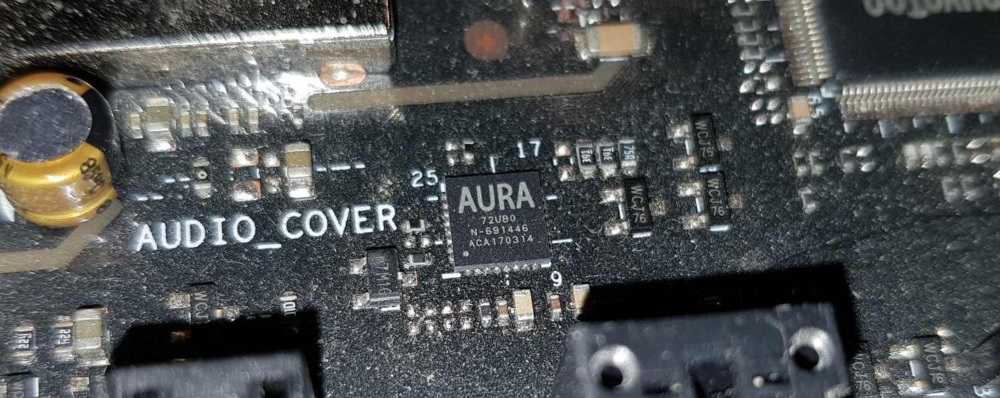

ASUS's Aura lighting system uses one or more custom AURA controllers on [SMBus](SMBus-Interface-Details).  Most boards have the controller enumerate at address 0x4E, though some boards use other addresses.  It also appears that some boards use a USB interface, particularly those with an addressable RGB header and X570 generation boards.  These USB controllers are not covered by this project yet.

Aura controllers use a modified memory-mapped control scheme where the standard 8-bit SMBus controller registers are used to write to an expanded 16-bit Aura controller address space.  The control registers for the Aura system are mapped in this 16-bit address space.

## Aura SMBus Registers
The Aura SMBus registers are used to communicate with the Aura controller's expanded 16-bit address space.

| Address | Function | Description |
| ------ | ------ | ------ |
| 0x00 | Write 16-bit Address Pointer | Write a 16-bit word containing the Aura address to access into this SMBus register before performing reads or writes.  Bytes are written in least significant byte first format, 0xLLHH where LL is low byte and HH is high byte of 16-bit Aura address. |
| 0x01 | Write Byte | Perform byte writes to 16-bit Aura address space to this register |
| 0x02 | Write Word | Perform word writes to 16-bit Aura address space to this register |
| 0x03 | Write Block | Perform block writes to 16-bit Aura address space to this register.  The 16-bit Aura address pointer is incremented after each byte |
| 0x05 | Write Block | Perform block writes to 16-bit Aura address space to this register.  The 16-bit Aura address pointer is NOT incremented after each byte |
| 0x01 | Read Byte | Perform byte reads from 16-bit Aura address space from this register.  The 16-bit Aura address pointer is incremented after each byte |
| 0x06 | Read Byte | Perform byte reads from 16-bit Aura address space from this register.  The 16-bit Aura address pointer is NOT incremented after each byte |
| 0x82 | Read Word | Perform word reads from 16-bit Aura address space from this register |
| 0x11 | Read 16-bit Address Pointer | Read a 16-bit word containing the Aura address to access from this register.  Bytes are read in least significant byte first format, 0xLLHH where LL is low byte and HH is high byte of 16-bit Aura address. |
| 0xA0 to 0xBF | Fixed Values | This set of registers returns 0x10 to 0x1F.  This pattern repeats at 0xC0 and 0xE0.  Useful for detecting the presence of an Aura controller |

## [Aura Controller Registers](Aura-Controller-Registers)

The SMBus Aura controllers use a register write system to set colors and settings.  The register memory space is 16 bits (0x0000-0xFFFF) and appears to contain the Aura controller's firmware, non-volatile settings, volatile settings, and some other information.  The color control registers are in the 0x8000 memory block.

## [Aura Software Information](Aura-Software-Information)

## [Known Motherboards](Known-Motherboards)

List of motherboards with their SMBus and Aura controller information.