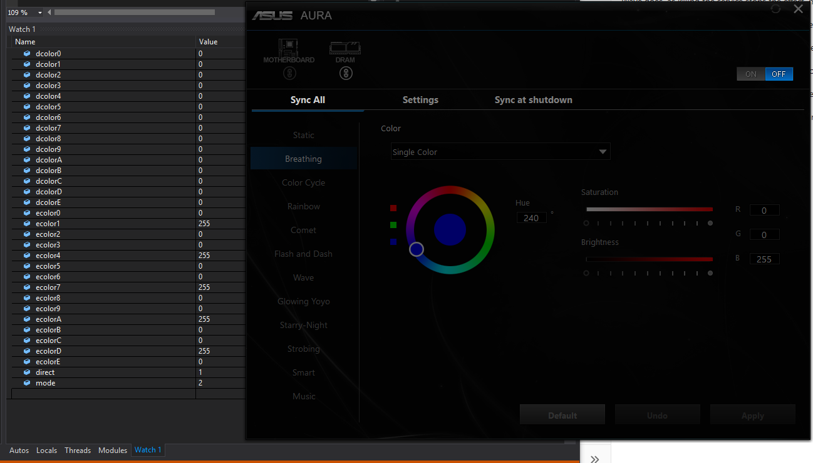

Notes about the Asus Aura software

Information gathered by using AuraRegisterRead function (i2c reads) after applying settings in Aura.

It has a background service called LightingService that appears to handle all the actual writes to the devices

Some modes involve continuous writes to the devices while others do not

Static does not, mode = 1, direct = 0

Breathing does not, breathing effect continues when service is killed, mode = 2, direct = 0

Color Cycle does not, colors keep cycling when service is killed, mode = 4, direct = 0

Rainbow does, as killing the service stops the effect, mode = unchanged, direct = 1

Comet mode does, as killing the service stops the effect, mode = unchanged, direct = 1

Flash and Dash does, as killing the service stops the effect, mode = unchanged, direct = 1

Wave does, as killing the service stops the effect, mode = unchanged, direct = 1

Glowing Yoyo does, as killing the service stops the effect, mode = unchanged, direct = 1

Starry-Night does, as killing the service stops the effect, mode = unchanged, direct = 1

Strobing does, as killing the service stops the effect, mode = unchanged, direct = 1

Smart and Music definitely do, as they are reactive to external inputs

Effects may be implemented in software for synchronization purposes?

Is there a speed register for built-in effects?

The off switch simply sets direct mode and clears all the direct color registers:

