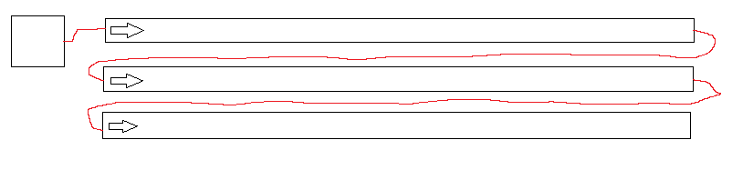

The E1.31 Streaming ACN protocol is a lighting control protocol used by many lighting controllers.  It implements a form of DMX512 over Ethernet.  It can be used to drive RGB LED lights.  The type of light depends on the device.  The E1.31 protocol is commonly used for LED strip controllers.

Here is a list of a few E1.31 open source firmware projects that will work with OpenRGB:

  * ESPixelStick: https://github.com/forkineye/ESPixelStick
  * WLED: https://github.com/Aircoookie/WLED
  * Espurna (E1.31 support in my fork): https://github.com/CalcProgrammer1/espurna/tree/calc-dev

OpenRGB uses libe131 by hhromic for E1.31: https://github.com/hhromic/libe131

# Setup

OpenRGB provides an E1.31 controller to drive these devices.  Since E1.31 does not provide an autodetection mechanism, E1.31 devices must be configured in the OpenRGB configuration file.  Multiple device entries are allowed, though you should make sure the universe/channel configuration of the devices do not overlap.

The format of an E1.31 device entry should match the following example:

```
    "E131Devices": {
        "devices": [
            {
                "name": "ESPixelStick 0 (Window)",
                "num_leds": 25,
                "rgb_order": "RGB",
                "start_channel": 1,
                "start_universe": 100,
                "type": "LINEAR"
            }
         ]
      }
```

This configuration creates a device called "Window Lights" on universe 6 that starts at channel 1 and contains 25 RGB LEDs, with byte order R, G, B.  This zone is considered a linear zone for effects.  At the moment, the RGB order is unimplemented and output will be R, G, B regardless of this setting.  Devices with more than 512 channels in use (3 channels per LED) will automatically roll over to the next universe.

# Basic Configuration

| Parameter         | Description                                                                                                   |
| ----------------- | ------------------------------------------------------------------------------------------------------------- |
| name              | String, device name                                                                     |
| num_leds          | Number of LEDs connected to the device                                                                        |
| start_universe    | E1.31 universe of the first LED on the device                                                                 |
| start_channel     | E1.31 channel of the first LED on the device                                                                  |
| type              | SINGLE - treated as a single LED zone, which tells effects engines to generate a single color for this device |
|                   | LINEAR - treated as a one-dimensional strip                                                                   |
|                   | MATRIX - treated as a two-dimensional matrix - see Matrix Configuration section below                         |
| rgb_order         | Byte order of the colors.  Options: RGB, RBG, GRB, GBR, BRG, BGR (not implemented yet, output always RGB)     |
| keepalive_time    | If non-zero, this will continuously output the E1.31 output at the given rate.  Value in milliseconds.        |
| ip                 | String, IP address of E1.31 device.  If IP is provided, unicast mode is used for this device.  If IP is not provided, multicast mode is used.                                                                                   |

# Matrix Configuration

You can configure an E1.31 device as an LED matrix.  Matrix configuration is done by adding these parameters to your E1.31 device entry.

| Parameter     | Value                   |
| ------------- | ----------------------- |
| matrix_width  | Width of matrix         |
| matrix_height | Height of matrix        |
| matrix_order  | One of the following:   |
|               | HORIZONTAL_TOP_LEFT     |
|               | HORIZONTAL_TOP_RIGHT    |
|               | HORIZONTAL_BOTTOM_LEFT  |
|               | HORIZONTAL_BOTTOM_RIGHT |
|               | VERTICAL_TOP_LEFT       |
|               | VERTICAL_TOP_RIGHT      |
|               | VERTICAL_BOTTOM_LEFT    |
|               | VERTICAL_BOTTOM_RIGHT   |

The matrix_order parameter determines where the matrix starts.  For example, a matrix wired in the layout below would use HORIZONTAL_TOP_LEFT as the strips are horizontal and the controller connects at the top left.

