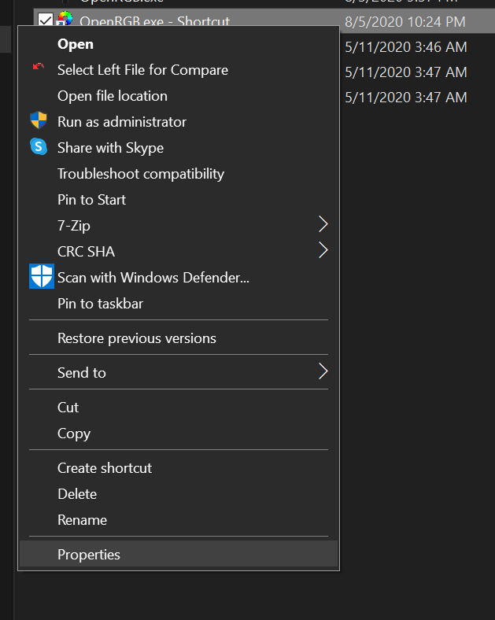
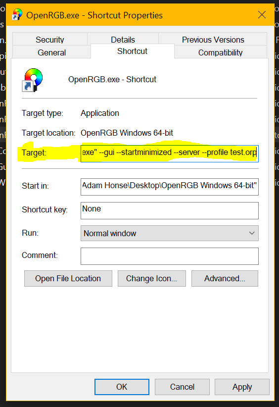
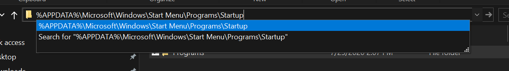
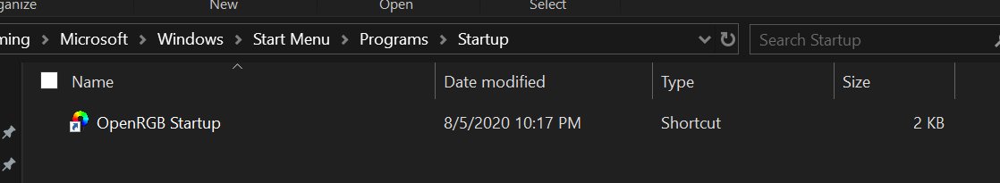
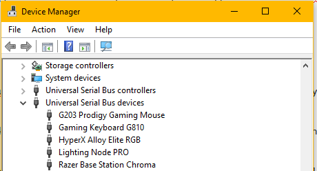
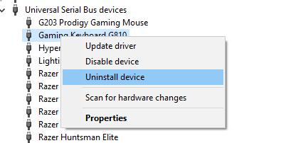
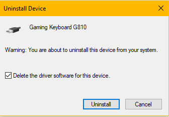
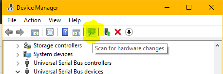

# Common (applies to both Windows and Linux)

### Why do I have an ASUS Aura DRAM device when I don't have an ASUS motherboard?

Many RGB RAM vendors use an RGB control chip that is nearly identical to the one found on early ASUS Aura motherboards.  Vendors using this controller include G.Skill, Geil, T-Force, A-DATA, and possibly others.  OpenRGB shows all of these devices as "ASUS Aura DRAM" as they use the same driver as the ASUS Aura motherboards with this chip.

### Not all of my ASUS Aura-compatible DRAM modules are showing.

ASUS Aura DRAM modules sometimes get into a state where they won't be detected.  It's possible they were assigned an address that OpenRGB doesn't check.  If they are not showing after a reboot, you can remove the sticks and install them all in different slots.  This appears to reset the on-board RGB controllers and then OpenRGB will detect them on the next power cycle.

### I have an ASUS and/or Gigabyte GPU that's not being detected.

OpenRGB has support for ASUS Aura GPUs and Gigabyte RGB Fusion GPUs.  However, because these vendors are always improving their products and putting more and more RGB, it's possible your GPU uses a different ASUS Aura or RGB Fusion control chip than the one that OpenRGB supports.  The two GPU implementations in OpenRGB only support single lighting zone GPUs.  If your GPU has more than one lighting zone, it is likely not supported.  I would be glad to help add support for more GPUs, but unfortunately reverse engineering GPUs is fairly complicated and requires a good deal of technical expertise.  GPUs are the most difficult RGB devices to reverse engineer that we know of.

# Windows

### OpenRGB won't detect my RAM or Motherboard

OpenRGB uses an interface called SMBus (also referred to as I2C) to communicate with RGB controllers on RAM modules and some motherboards.  On Windows, SMBus access requires administrator privileges using a library called inpout32 (inpoutx64 for the 64-bit version).  You must run OpenRGB as administrator at least once for inpout32 to set up.  Once it has been set up, you may run OpenRGB without administrator and it will be able to access these devices.

If you have problems accessing these devices even after running as administrator, it is possible that a kernel anti-cheat or anti-virus application is blocking the inpout32 driver from functioning.  Riot Games' Vanguard (VALORANT) anti-cheat system has been known to block inpout32 as well as some official RGB applications.  If you have VALORANT installed, you will have to uninstall it or disable the Vanguard anti-cheat in order to use OpenRGB with these devices.

If you do not have such an anti-cheat system installed and are still having problems, make sure any other RGB applications (ASUS Aura, Corsair iCUE, Gigabyte RGB Fusion, etc) are disabled or uninstalled.  This includes disabling their background services.  The SMBus only works properly if one application at a time is accessing it, and if two applications try to control the device at the same time, it can confuse the device or put it in an invalid state.  This behavior can result in OpenRGB not detecting devices properly.

### I'm missing VCRUNTIME140_1.dll

Download the latest Visual C++ runtime from Microsoft here: https://support.microsoft.com/en-us/help/2977003/the-latest-supported-visual-c-downloads

### Can I have OpenRGB start automatically when I log in?

Yes!  You can create a startup shortcut to OpenRGB and even customize how it starts.  Start by creating a shortcut to OpenRGB.exe:


Now you can go into the Properties of your new shortcut to add startup options:



In the Target: field, you can add startup options:



The complete list of startup options is available in the command line interface, but ones that make sense for use in a shortcut are listed below.

| Startup Argument         | Description                                                                                                                            |
| ------------------------ | -------------------------------------------------------------------------------------------------------------------------------------- |
| --gui                    | Enables the GUI interface.  This is automatically specified if you start with no options or if you use --startminimized or --i2c-tools |
| --startminimized         | Start the GUI minimized to the system tray.  The main window will not pop up, but the OpenRGB icon will show in the tray.              |
| --server                 | Start with the SDK server running.  You will need to specify --gui if you want to use this option and still see the GUI.               |
| --profile <filename>     | Load the specified profile file when OpenRGB starts.                                                                                   |

Now, to make this shortcut run when you log in to Windows, copy the shortcut file to %APPDATA%\Microsoft\Windows\Start Menu\Programs\Startup



You can rename the shortcut if you want.



Now simply reboot your computer or log out and log back in.  OpenRGB should automatically start with the options you have configured.

### I installed the WinUSB driver for a device and I wish to uninstall it

The WinUSB driver can be removed in Device Manager.  Open Device Manager.  You should have a category called "Universal Serial Bus devices".



Right click on the device you want to uninstall.  Click "Uninstall device"



Check the box that says "Delete the driver software for this device" and then click Uninstall.



Finally, to have Windows re-detect the device with its original driver, click the "Scan for hardware changes" button.



# Linux

### My Razer devices aren't being detected

OpenRGB uses the OpenRazer kernel drivers in Linux.  Most distributions provide OpenRazer packages.  You do not need the OpenRazer daemon but you do need the kernel drivers installed.

### My non-Razer USB devices aren't being detected

You need to install the OpenRGB udev rules.  These are provided in the 99-openrgb.rules file in this repository.  Copy this file to /etc/udev/rules.d and then trigger a rules reload with the following commands:

sudo udevadm control --reload-rules

sudo udevadm trigger

### I have an AMD GPU.  Can I use OpenRGB?

GPU support in OpenRGB is already limited to a handful of ASUS and Gigabyte cards, but Linux poses an additional problem for AMD GPU users.  AMD's drivers do not expose the GPU's on-board i2c bus, only those for the display connectors.  GitHub user [twifty](https://github.com/twifty) has been working on a driver for the AMD GPU i2c bus.  It appears to work on Polaris cards but not Vega or Navi cards at the moment.  It requires patching your kernel.  I have not tested it personally, but I know other users have had it working with OpenRGB for certain ASUS Aura enabled GPUs.

https://github.com/twifty/aura-gpu

### Can I set up OpenRGB as a systemd service?

Yes, use this configuration file, provided in https://gitlab.com/CalcProgrammer1/OpenRGB/-/issues/202:

```
[Unit]
Description=OpenRGB control

[Service]
Type=oneshot
ExecStart=/usr/bin/openrgb -c 080808 -m Direct
User=nobody
Group=i2c

[Install]
WantedBy=multi-user.target
```
