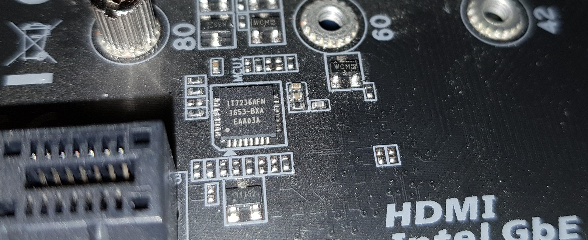

Gigabyte's first generation RGB Fusion enabled motherboards use an ITE IT7236AFN microcontroller to control their two-zone RGB lighting system.  This microcontroller attaches to the system via [SMBus](SMBus-Interface-Details) and enumerates at address 0x28.  The protocol appears to be register mapped with a bank selection register (0xF0) to expand the I/O address space.  Banks 0 and 1 are used in the commands to set modes.

There are two control channels.  I'm calling them 0 and 1.  Channel 0 controls the motherboard's on-board RGB LEDs as well as the RGB header near the CPU.  Channel 1 controls the RGBW header near the bottom edge of the board.  The channels appear to be independent - they may have different colors and different modes.

To update a color, you first write your RGB values to the RGB color registers, then write to the mode register with the desired mode.  The color changes do not apply until the mode is updated.

Registers can be read from using the standard SMBus read functionality.  You can pull the current settings from the controller using this method.

## Bank Selection Register
| Address | Function |
| ------ | ------ |
| 0xF0 | Bank Selection |

## Bank 0 Registers
| Address | Function                              |
| ------- | ------------------------------------- |
| 0x03    | Channel 0 Mode Selection              |
| 0x05    | Brightness, 0:100%, 1:75% 2:50% 3:25% |
| 0x06    | Channel 0 Time 0 MSB                  |
| 0x07    | Channel 0 Time 0 LSB                  |
| 0x08    | Channel 0 Time 1 MSB                  |
| 0x09    | Channel 0 Time 1 LSB                  |
| 0x13    | Channel 1 Mode Selection              |
| 0x16    | Channel 1 Time 0 MSB                  |
| 0x17    | Channel 1 Time 0 LSB                  |
| 0x18    | Channel 1 Time 1 MSB                  |
| 0x19    | Channel 1 Time 1 LSB                  |

## Timer values for speed settings in Pulsing and Flashing modes
| Timer | Low Speed | Medium Speed | High Speed |
| ----- | --------- | ------------ | ---------- |
| 0     | 0x01E0    | 0x00F0       | 0x0078     |
| 1     | 0x4000    | 0x2000       | 0x1000     |

## Bank 1 Registers
| Address | Function |
| ------ | ------ |
| 0x00 | Channel 0 Red |
| 0x01 | Channel 0 Green |
| 0x02 | Channel 0 Blue |
| 0x08 | Channel 1 Red |
| 0x09 | Channel 1 Green |
| 0x0A | Channel 1 Blue |

## Modes
The modes are read out of the mode register as the values below, but to write the modes to the mode register you must add the offset 0x10.  This is shown in the Write Value column.

| Value | Description | Write Value |
| ----- | ----------- | ----------- |
| 0x00  | Static      | 0x10        |
| 0x01  | Pulsing     | 0x11        |
| 0x02  | Flashing    | 0x12        |
