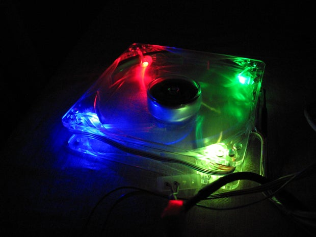

OpenRGB is the culmination of all my previous RGB projects, so I thought I'd do a writeup on the history of OpenRGB and my previous RGB projects.

I became interested in RGB control in fall 2009 when I bought my first Arduino and AVR microcontroller stuff to start learning how to program microcontrollers.  I was a sophomore in college at the time and hadn't started any microcontroller courses yet, but I had some C and C++ experience under my belt and didn't want to wait to play with microcontrollers in class.  Among the parts I ordered was a single RGB LED.  The idea of a color changing LED was pretty interesting, and after playing around with PWM controls and basic color math I wanted to do more RGB projects.  A few months later I was upgrading my personal file server to a new case and bought a blue LED fan to install in the case.  I was disappointed to discover the fan I received had a burned out LED!  Newegg shipped out a replacement, but let me keep the fan with the dead LED.  This led to a project idea - what if I used my newfound microcontroller knowledge to stick RGB LEDs in the fan and make it controllable?  RGB peripherals and fans weren't a thing in 2009.

## 2009-2010 - RGB Fan Controller

I decided to design and build a fan controller.  I wrote up a detailed Instructable about it and posted some videos to YouTube.

https://www.instructables.com/id/Color-Changing-Digital-PC-Fan-Controller/

RGB fan going through a pre-programmed test cycle: https://www.youtube.com/watch?v=TJ_oJXBIyJ4&t=19s

Controlling the RGB fan with a GUI: https://www.youtube.com/watch?v=4J4vlAMgQDQ

## 2011 - FanBus Fan Controller

In the summer of 2010 I built my first real gaming PC.  A year later I decided I wanted RGB lights in it, so I built up three more fan controllers.  I modified the design a bit and came up with a protocol I called "FanBus" which was a half-duplex serial interface with an addressing scheme that could allow multiple fans/LEDs on one serial port.  The addressing scheme was inspired by i2c, which is pretty funny given that a lot of commercially-available RGB devices use i2c now (RAM, motherboards, GPUs).  Again, I wrote an Instructable on it.

https://www.instructables.com/id/FanBus-Digital-Fan-and-LED-Interface-for-PC/

After building this fan controller and writing a GUI to control it, I discovered the Processing language and a Processing script for audio visualization.  This inspired me to hack together a script that flashed my FanBus LEDs to music.  The end result was this video:

https://www.youtube.com/watch?v=kQJaOcYtfAg&t=39s

## 2012 - Audio Visualizer C Rewrite

In 2012, after I was out of college and moved into my own place, I had some free time to play around with my visualizer a bit more.  I ended up learning how to use OpenAL to capture audio and found an FFT implementation in C so I could get rid of Processing and have a more efficient visualizer.

https://www.youtube.com/watch?v=c1-O5rGwaR4

## 2012 - GE Color Effects hacking

I wanted to decorate my new place with Christmas lights.  The GE Color Effects lights were popular in the hacking community then as they were individually addressable RGB LEDs that you could drive from a microcontroller.  The WS28xx controllers and LEDs weren't out yet so these were the best thing ever.  I hacked together a controller with an ATTiny2313.  Later, I added a Bluetooth module to make it wireless.

https://www.youtube.com/watch?v=tSiW6Ait6tM&t=117s

## 2013 - Single-zone LED controller

I added a single-zone RGB LED strip to my setup controlled by an ATMega328 running my FanBus code.  It's basically the same controller as the fans in my PC.

https://www.youtube.com/watch?v=lWygfSimkyE&t=50s

## 2014 - Corsair K70 RGB

In 2014, rumors began circulating that Corsair was going to make a mechanical keyboard with individual key RGB backlighting.  I was hyped.  I preordered the K70 RGB and was one of the first to get my hands on it.  Needless to say, the first thing I did was reverse engineered the protocol.  I followed a reverse engineering guide I found online and documented the protocol.

https://www.reddit.com/r/MechanicalKeyboards/comments/2ij2um/corsair_k70_rgb_usb_protocol_reverse_engineering/

https://www.youtube.com/watch?v=MRE38mMJ1QY

The next step was to wire it up to my audio visualizer, first treating it as a single zone.

https://www.youtube.com/watch?v=N7QeGXOZ6Es

I then wrote a program to turn on each LED individually and print the index.  I was able to use this information to create a keymap.

https://www.youtube.com/watch?v=muaoJqsvEnU&t=22s

A reddit user helped write code to map an X/Y matrix onto the keyboard.  With that I created a rainbow wave.

https://www.youtube.com/watch?v=M7RxgMBSgHQ&t=3s

Finally, all the pieces fell into place to map a spectrograph onto the keyboard.

https://www.youtube.com/watch?v=tJ5r1P2u7mU

Throughout the fall of 2014, there was a big controversy around the color depth of the K70 RGB.  The protocol showed that each color was only using 3 bits instead of 8, meaning there were a total of 512 possible colors rather than the advertised 16.8 million (which would be true if it were 8 bits per color channel).  I did some digging into datasheets and proved that they weren't advertising this thing correctly.  They promised to fix it in a firmware update, and we were skeptical because the hardware didn't really support what they were trying to do.  The firmware was delayed for ages.  Honestly, it still doesn't work quite right and you can obviously tell they're faking 16.8M color mode on the old Kxx RGB keyboards.  The newer models have actual 16.8M color controllers.

https://forum.corsair.com/v3/showthread.php?t=133172

## 2015 - Razer Blackwidow Chroma

Anyways, in early 2015 I decided to buy a second-hand Razer Blackwidow Chroma just to see if it (the K70 RGB's only competition at the time) had true 16.8M color support.  Newsflash, it did.  Razer also released an SDK right around that time, so I added the Razer Blackwidow Chroma to my visualizer.

https://www.youtube.com/watch?v=x-8EzcXE-_E&t=112s

https://www.youtube.com/watch?v=MD8zr4LKvNA&t=8s

https://www.youtube.com/watch?v=l0UY21WMbas&t=7s

## 2015 - Keyboard Visualizer

In the summer of 2015, I was contacted by a Razer employee after posting my visualizer on their forums.  He asked if I was willing to develop a more user-friendly version of my visualizer if Razer sent me some free stuff to support.  I said yes, because of course I wanted free Razer gear.  The first version of Keyboard Visualizer was released.

https://www.youtube.com/watch?v=OsxzAOYoaAY&t=136s

## 2016 - Keyboard Visualizer Continues

I added a lot of additional things to Keyboard Visualizer including WS28xx LED strips powered by Arduino and ESP8266 microcontrollers, peripherals from other manufacturers, and Linux support using OpenRazer and some reverse-engineered protocols.

https://www.youtube.com/watch?v=ADjqh90VrvM

https://www.youtube.com/watch?v=AWyUPqIWzsQ

https://www.youtube.com/watch?v=1Hs6YfM7MD8

https://www.youtube.com/watch?v=N-uRcLoebyc

https://www.youtube.com/watch?v=Y6QX3YXD31E

## 2017 - Reverse Engineering ASUS Aura

I upgraded to Ryzen on launch day, and with that came an Aura enabled motherboard and Trident Z RGB RAM.  This led to a huge discussion on GitHub where I and a lot of other users worked to reverse engineer Aura.  We had no clue how to talk to i2c devices in Windows and weren't even sure that i2c was in use, so it took a lot of digging and a lot of aha moments before we knew what we were looking at.  Finally, after hundreds of comments and a few months of research, we had Aura control without the Aura app.  It wasn't until a few months after this that Asus released an SDK for Aura.  If you want to learn about reverse engineering, reading through this thread would probably interest you.

https://gitlab.com/CalcProgrammer1/KeyboardVisualizer/-/issues/85

Support was added to Keyboard Visualizer in a branch, but at the time we didn't have a way to properly detect the presence of an Aura controller, so it was never merged.

https://www.youtube.com/watch?v=346MoRuk1mE

## 2019 - OpenAuraSDK

I didn't do much work on my projects for a year or so, but in 2019 I decided to take what we had reverse engineered and turn it into a functional Aura control panel.  I started working on a program that would properly detect the presence of Aura controllers on i2c as well as Aura compatible RAM.  I figured out how to dump the memory space of an Aura controller, how to get the firmware string, and how to parse the configuration table.  I wrote documentation on the OpenAuraSDK project wiki.  By summer, OpenAuraSDK was mostly functional on both Windows and Linux.  At that point I wanted to keep developing it so I bought some RGB RAM from other vendors and started trying to reverse engineer that.  I ended up writing a tool for sniffing the SMBus data which made reverse engineering much easier than what we had done in 2017.  The first devices reverse engineered were Corsair RGB RAM and HyperX RGB RAM.  Since OpenAuraSDK's user interface was specifically written around the Aura functionality, I ended up making a new branch to develop a generic RGB control interface.  A very simple GUI was made and I added all the devices I already knew how to control - Aura, Corsair RAM, HyperX RAM, Arduino LED strips, Razer Chroma SDK, and a few others.

## 2019-2020 - OpenAuraSDK becomes OpenRGB

By December 2019, I had a growing collection of devices supported by the generic_rgb_interface branch of OpenAuraSDK.  I wanted to make this branch into the focus of the project as it was more useful than just controlling Aura.  I made an improved user interface for the generic RGB interface and decided to rename the project OpenRGB, as keeping the Aura naming would imply it's just for Asus devices.  I officially switched the repo name, updated all the references of OpenAuraSDK to OpenRGB, and pushed the changes to the project.  That basically takes us to here and now, where OpenRGB has grown in both developer contributions and user count especially after a few Reddit posts and the creation of a Discord server.  With the creation of the OpenRGB SDK, I went back and reworked Keyboard Visualizer to use OpenRGB instead of the proprietary SDKs and hacked-together reverse engineered devices it had.