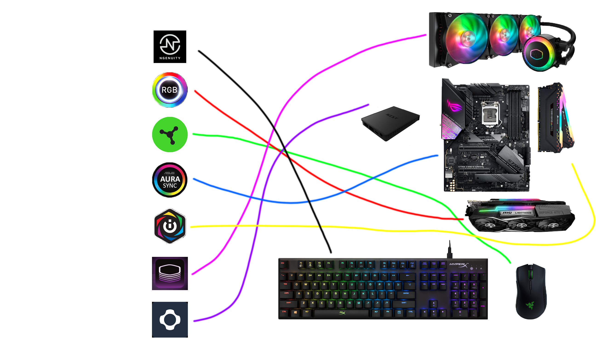
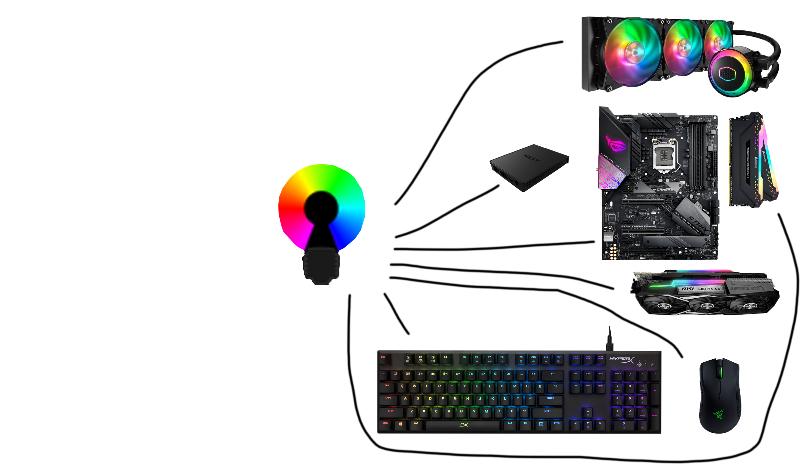
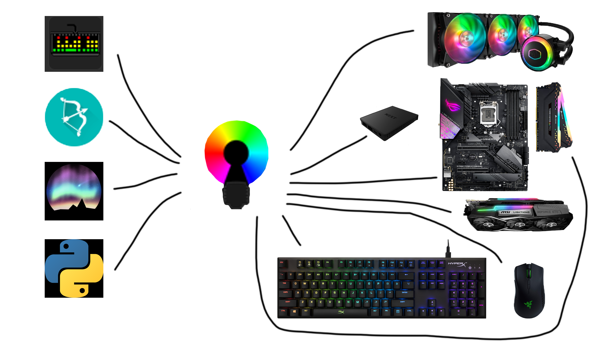

# How OpenRGB works

## The Problem

On Windows all of the RGB component manufacturers have their own software leading to Fragmentation, Higher disk usage higher memory usage, and an overall terrible experience

On Linux there is basically no manufacturer that has support for controlling the hardware from linux leading to (In my opinion) an even worse experience than windows

## The Solution

OpenRGB is the solution. Allowing for a uniform experience regardless of the device manufacturer.

Giving everyone the same UI for all of the devices that it has support. (with more being added daily!)

## What does openRGB do

It replaces the following situation

With this

You may be thinking "What about my effects? OpenRGB doesn't do effects right?"

well because of OpenRGB's SDK the following is possible

You can use any effects engine you want that supports openRGB or you can even write your own effects in a variety of coding languages

## How it works

It bypasses the need for the device manufacturer's software by talking straight to the device through reverse enginered protocols

Allowing for a single (very light) peice of software to controller all of the RGB in your system
