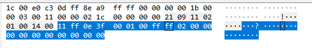

The Logitech G203 Prodigy mouse enumerates at 046D:C084 and uses HID feature reports.  It does not look like this mouse supports any save-to-device functionality, as it always defaults to the cycling mode.



```
Off:                     11 ff 0e 3c 00 00 00 00 00 00 00 00 00 00 00 00 00 00 00 00

Fixed Red:               11 ff 0e 3c 00 01 ff 00 00 02 00 00 00 00 00 00 00 00 00 00

Fixed Green:             11 ff 0e 3c 00 01 00 ff 00 02 00 00 00 00 00 00 00 00 00 00

Fixed Blue:              11 ff 0e 3c 00 01 00 00 ff 02 00 00 00 00 00 00 00 00 00 00

Cycle (Default):         11 ff 0e 3c 00 02 00 00 00 00 00 13 88 64 00 00 00 00 00 00

Cycle (Slowest):         11 ff 0e 3c 00 02 00 00 00 00 00 4e 20 64 00 00 00 00 00 00

Cycle (Fastest):         11 ff 0e 3c 00 02 00 00 00 00 00 03 e8 64 00 00 00 00 00 00

Cycle (1% Bright):       11 ff 0e 3c 00 02 00 00 00 00 00 4e 20 01 00 00 00 00 00 00

Breathing Red (Slowest): 11 ff 0e 3c 00 03 ff 00 00 4e 20 00 64 00 00 00 00 00 00 00
```

Packet structure

| Byte Index | Description |
| ---------- | ----------- |
| 0x00       | 0x11        |
| 0x01       | 0xFF        |
| 0x02       | 0x0E        |
| 0x03       | 0x3C        |
| 0x04       | 0x00        |
| 0x05       | Mode        |
| 0x06       | Red         |
| 0x07       | Green       |
| 0x08       | Blue        |
| 0x09       |             |
| 0x0A       |             |
| 0x0B       |             |
| 0x0C       |             |
| 0x0D       |             |
| 0x0E       |             |
| 0x0F       |             |
| 0x10       |             |
| 0x11       |             |
| 0x12       |             |
| 0x13       |             |