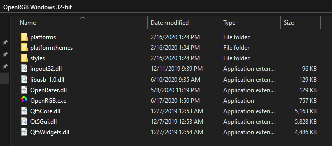
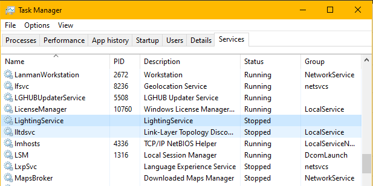
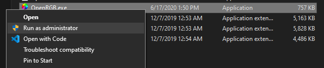
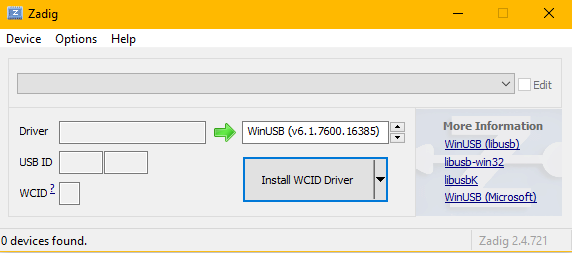
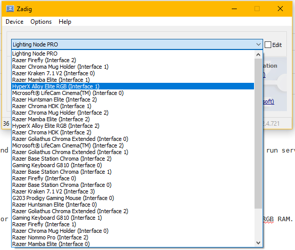
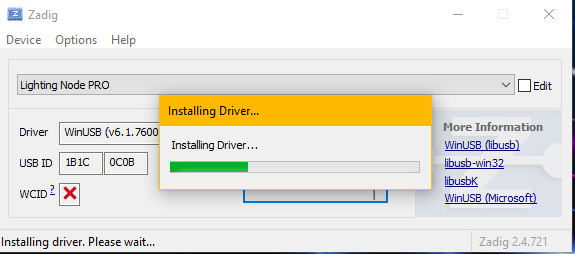

# OpenRGB Windows Setup and Usage

This page describes how to set up and use OpenRGB on your Windows PC.

# Download OpenRGB

You can download the latest version of OpenRGB from the [Releases Page](https://gitlab.com/CalcProgrammer1/OpenRGB/-/releases)

The builds are provided for both 32- and 64-bit Windows.  They are provided as .7z archives.  Use [7-zip](https://www.7-zip.org/) to extract them.  You should end up with a folder containing the OpenRGB files.

# Disable other RGB applications

Before you open OpenRGB, make sure all other RGB applications are closed.  This includes ASUS Aura, RGB Fusion, iCue, Mystic Light, Razer Synapse, Logitech G Hub, and any other RGB app you may have active.  Note that some of these run services that you can stop in Task Manager.  For instance, LightingService for ASUS Aura.

# First Run

When opening OpenRGB.exe for the first time, you must run it as Administrator for it to detect certain devices.  This installs a driver called inpout32 (inpoutx64 for 64-bit) that allows OpenRGB to access certain motherboards and RGB RAM.

# It didn't detect my device!  What now?

THIS STEP IS NO LONGER REQUIRED AS OF OPENRGB 0.3!  Please [uninstall WinUSB](https://gitlab.com/CalcProgrammer1/OpenRGB/-/wikis/Frequently-Asked-Questions#i-installed-the-winusb-driver-for-a-device-and-i-wish-to-uninstall-it) if it is installed.

Most USB devices will need a special driver called WinUSB in order to work with OpenRGB.  To install this driver you will need to use a tool called [Zadig](https://zadig.akeo.ie/).

When you open Zadig, the window will be empty.

Go to the Options menu and click List All Devices.  The drop-down will now show all USB devices connected to your computer.

For mouse and keyboard devices, you will always want to select the highest Interface number.  Look through the full list and make sure you're selecting the highest numbered Interface for your device.  Otherwise, you may overwrite the driver handling the actual keyboard or mouse input device and be unable to use your keyboard or mouse until you uninstall the WinUSB driver.

For the AMD Wraith Prism, use interface 1.  It has a messy name.

For ASUS Aura USB motherboards, use Interface 2.

Once you've selected the correct Interface, click the Install Driver button.  You will see an installing dialog.  Installation may take several minutes

Once that is done, you may reopen OpenRGB and your device should be detected.

# It STILL didn't detect my device!

It's possible WinUSB didn't install correctly.  It's also possible your device is in a weird state.  If you've done the above things and are not seeing your device show up when opening OpenRGB, you can try fully powering off your computer.  For best results, you should switch off the power supply or unplug the computer from the wall, just to make sure it is completely off.  Some motherboard RGB controllers remain powered in standby mode (when the PC is "off") and I've had my Aura controller need resetting from a full disconnect.  Plug it back in, switch it back on, and boot up.  Don't open any other RGB app, just open OpenRGB right away.  Hopefully that will get it detected and working.