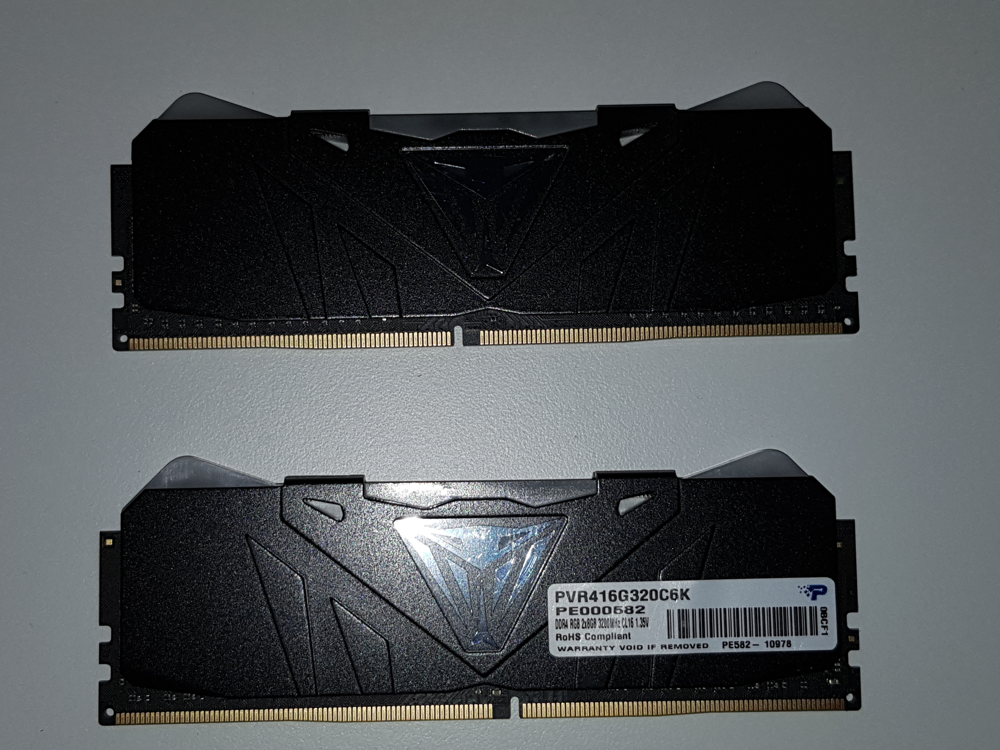

The Patriot Viper RGB memory enumerates an SMBus device at 0x77.  It uses an SMBus protocol that uses two SMBus byte writes for writing 3 bytes to an address.  The protocol works as follows:

Write \<Value 1\> to \<Address\>

Write \<Value 2\> to \<Value 3\>

To initiate a write sequence, you have to write 0xFF to address 0xFF twice.

# Addresses

| Address | Value 1   | Value 2    | Value 3     | Description     |
| ------- | --------- | ---------- | ----------- | --------------- |
| 0x01    | 0x04      | 0x00       | 0x00        | Start (?)       |
| 0x03    | Mode      | ?          | Speed       | Mode            |
| 0x30    | LED 0 Red | LED 0 Blue | LED 0 Green |                 |
| 0x31    | LED 1 Red | LED 1 Blue | LED 1 Green |                 |
| 0x32    | LED 2 Red | LED 2 Blue | LED 2 Green |                 |
| 0x33    | LED 3 Red | LED 3 Blue | LED 3 Green |                 |
| 0x34    | LED 4 Red | LED 4 Blue | LED 4 Green |                 |
| 0x35    | 0x01      | 0x00       | 0x00        | Apply Changes   |
| 0x3B    | LED 0 Red | LED 0 Blue | LED 0 Green | Effect Color    |
| 0x3C    | LED 1 Red | LED 1 Blue | LED 1 Green | Effect Color    |
| 0x3D    | LED 2 Red | LED 2 Blue | LED 2 Green | Effect Color    |
| 0x3E    | LED 3 Red | LED 3 Blue | LED 3 Green | Effect Color    |
| 0x3F    | LED 4 Red | LED 4 Blue | LED 4 Green | Effect Color    |
| 0xFF    | 0xFF      | 0xFF       | 0xFF        | Start Frame (?) |

# Modes

| Mode Value | Mode Description | Slow Speed | Default Speed | Fast Speed |
| ---------- | ---------------- | ---------- | ------------- | ---------- |
| 0x00       | Dark             |            |               |            |
| 0x01       | Breathing        |            | 0x0C          |            |
| 0x02       | Viper            | 0xC8       | 0x64          | 0x14       |
| 0x03       | Heartbeat        |            | 0x64          |            |
| 0x04       | Marquee          |            |               |            |
| 0x05       | Raindrop         |            |               |            |
| 0x06       | Aurora           |            |               |            |
| 0x08       | Neon             |            |               |            |
| 0xAA       | Apply Effect     | N/A        | N/A           | N/A        |
| 0xFA       | Start Effect     | N/A        | N/A           | N/A        |
