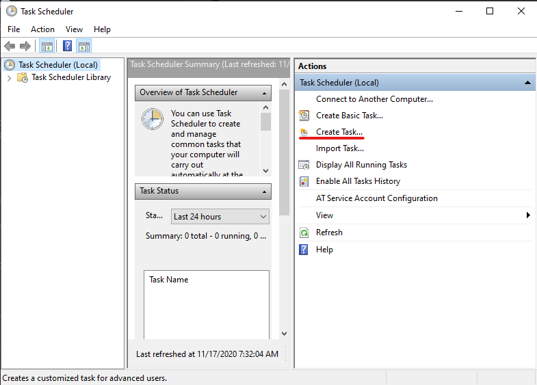
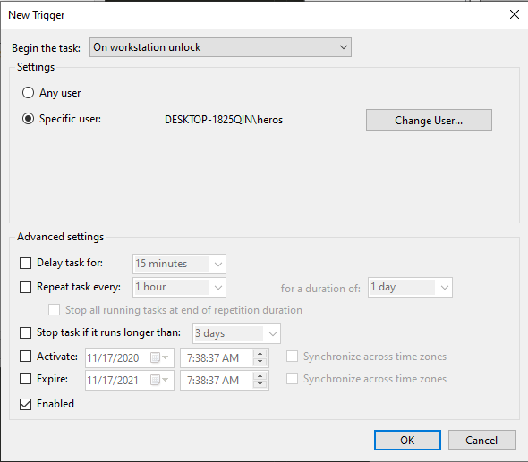
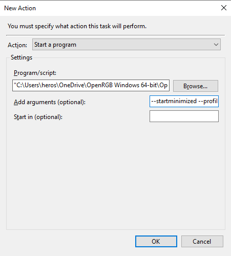

# Making OpenRGB resume after sleeping (Or undoing it)

For users that suspend their PC and have devices that *don't* have a flash to remember modes through a power cycle you may want to have openRGB continue running.

Detailed below are copy and pastable instructions for Windows and linux systemd based distributions.

## Adding the Task

### Adding to Linux

1. ``cd /usr/lib/systemd/system-sleep`` : This will change the current working folder to where we want our file to be

2. ``sudo nano OpenRGBsleep.sh`` : This will open a CLI based text editor to paste the following script into. If you don't have nano you can use the text editor of your choice.

3. Paste the following into the text editor that was opened by the previous command

    ```bash
    #!/bin/sh
    # Default config directory for profiles is ~/.config/OpenRGB
    PROFILE = "profile.orp"

    case $1/$2 in
      pre/*)
        ;;
      post/*)
        pkill --signal term -f OpenRGB
        OpenRGB --startminimized --profile $PROFILE
      ;;
    esac
    ```

    Make sure to replace the profile variable with the appropriate profile you want to apply, stored in ``~/.config/OpenRGB``

4. Hit ctrl + x followed by "y" and then enter (exit file, save changes, save name)

5. Change the bash file to executable by running ``sudo chmod +x OpenRGBsleep.sh``

You should now be good to go

### Adding to Windows

1. Open Task scheduler
  
   

2. Create a new task

   

3. Configure your settings

  

  Make sure that you have it set to ``Run only when user is logged on``

  In the Triggers tab: Click New down in the bottom left

  The task should begin ``On workstation unlock`` for *your* specific user

  

  In the Actions tab: Click New down in the bottom left

  

  The program/script field *must* point to the openRGB exe file

  The arguments field should be ``--startminimized --profile profile.orp`` But replace ``profile.orp`` with whatever you named your profile

  The other tabs Don't matter and you can just save the task now

## Removing the tasks

### Removing from linux

1. Once again you will want to open a terminal and ``cd /usr/lib/systemd/system-sleep``

2. type in ``sudo rm OpenRGBsleep.sh`` and hit enter (This *will* delete the file)

You should be good to go now

### Removing from Windows

1. Go to task scheduler again

2. in the active tasks page search for whatever you named your task (search by clicking any of the tasks and then start typing)

3. Once your task has been located you can double click and disable or delete on the far right side actions menubar (near the bottom of the bar)

The task should be gone now and it won't run again until you re-create it or re-enable it
