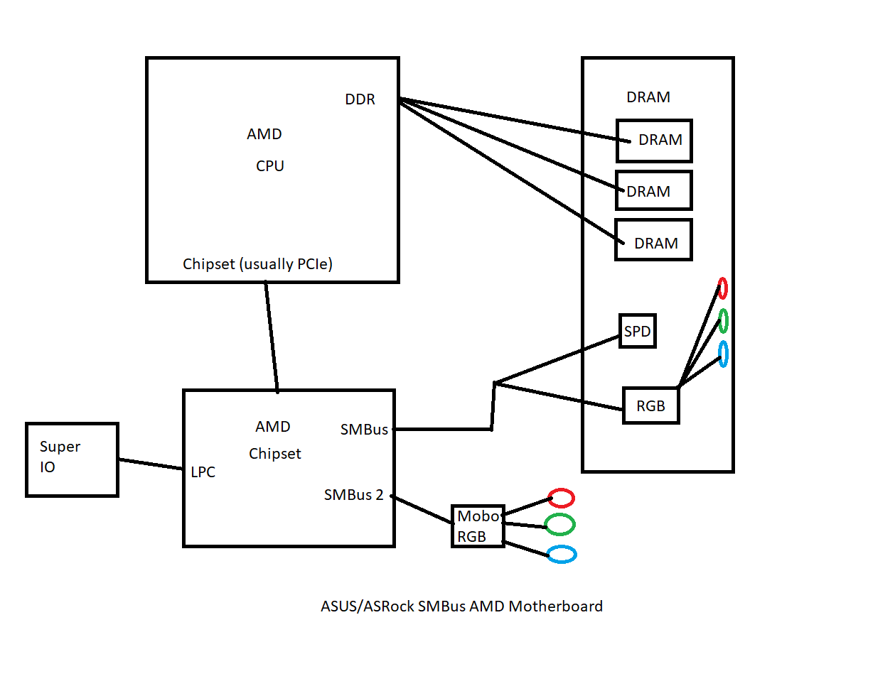
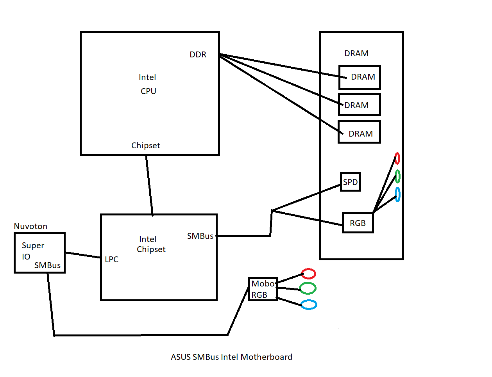
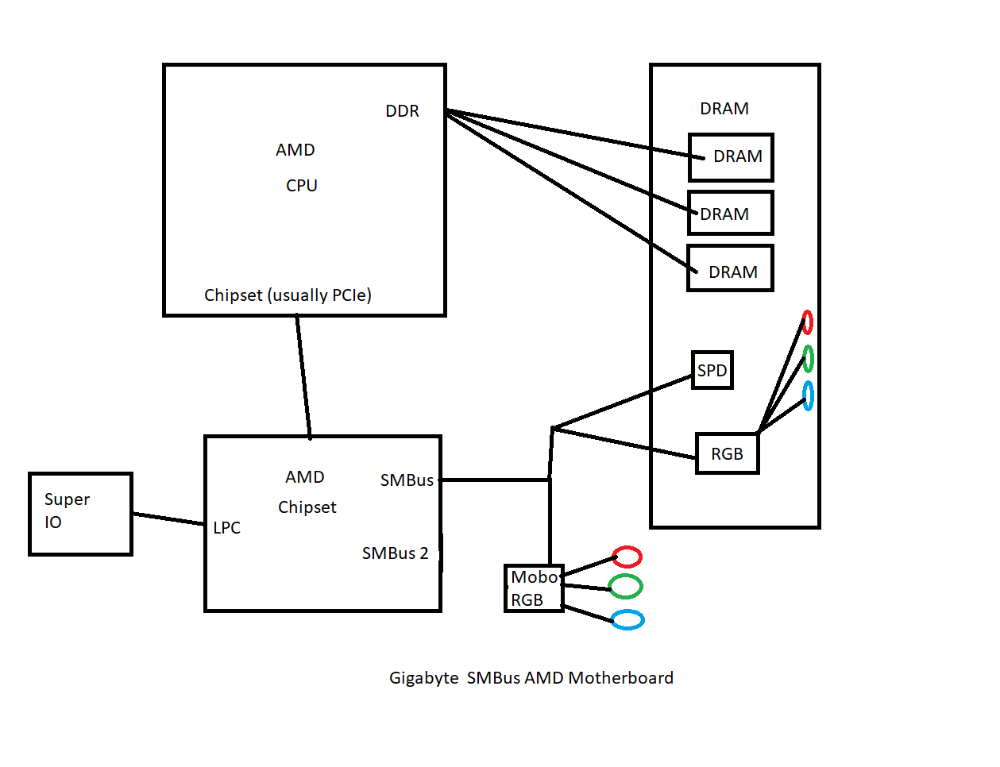

Many RGB lighting systems present on motherboards and RAM modules use controller chips connected via the [System Management Bus (SMBus)](https://en.wikipedia.org/wiki/System_Management_Bus) of the PC.  SMBus is an extended version of the [I2C](https://en.wikipedia.org/wiki/I%C2%B2C) interface, which is a common low-level serial bus found on many embedded devices.  I2C uses a master-slave topology, with one master device (the PC) able to send and receive data from one or more slave devices (the RGB controllers).

On motherboards, the SMBus master is usually part of the chipset and/or Super IO chip.  Windows does not provide user-accessible drivers for transferring data on the SMBus interfaces, but Linux does.  The [i2c-tools package](https://i2c.wiki.kernel.org/index.php/I2C_Tools) provides user-accessible set, get, and detect functions to talk to I2C/SMBus devices on your PC's motherboard.  This was very beneficial in early reverse engineering efforts.

Since Windows does not provide useful SMBus drivers, we need to provide our own user-mode drivers for all the SMBus controllers we intend to support.  Luckily, the Linux source code has I2C/SMBus drivers for a wide variety of chipsets we can borrow.  The [inpout32 library](http://www.highrez.co.uk/downloads/inpout32/) allows Windows programs to access "I/O port" memory regions on x86/x64 processors.  This memory region is where the memory-mapped control registers for most SMBus controllers reside.  Combining the Linux i2c source code with inpout32 to set the registers we can port SMBus controller drivers to Windows.  I have already done so for the i2c_smbus_piix4 driver as that's what my AMD X370 chipset uses.

Some chipsets (such as the AMD X370) have multiple SMBus interfaces.  During our reverse engineering efforts, we discovered that there were two identical register sets at 0x0B00 and 0x0B20 on the X370, with the RAM SMBus on 0x0B00 and the motherboard RGB controller attached to the secondary SMBus on 0x0B20.  The Linux driver didn't see this second bus but a quick kernel change later and it was working.  Luckily on our user-space Windows driver we can just edit the base register address to talk to both buses.

Intel chipsets appear to only have a single SMBus interface.  This interface is used to communicate with the RAM on all motherboards.  In Asus' case, they decided to use the SMBus controller built into the Nuvoton Super I/O chip for the motherboard Aura controller.  Unfortunately, Linux does not provide drivers for the SMBus interface on the Super IO controller, so I wrote a new driver from scratch using information from the datasheet.  This driver works on Windows and is provided as a kernel patch for Linux.

# Known SMBus Topologies

## ASUS (without ARGB), ASRock AMD Motherboards

## ASUS (without ARGB) Intel Motherboards

## Gigabyte AMD Motherboards

