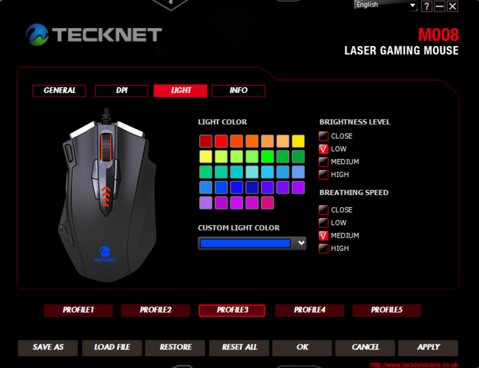

The Tecknet M008 RGB mouse enumerates at 04D9:FC05.  RGB control on Interface 2.  Protocol is HID using 16-byte feature reports.

# Packet structure

| Byte Index | Description      |
| ---------- | ---------------- |
| 0x00       | 0x02             |
| 0x01       | 0x04             |
| 0x02       | Red (Inverted)   |
| 0x03       | Green (Inverted) |
| 0x04       | Blue (Inverted)  |
| 0x05       | 0x01             |
| 0x06       | Breathing Speed  |
| 0x07       | 0x00             |
| 0x08       | 0x00             |
| 0x09       | 0x00             |
| 0x0A       | 0x00             |
| 0x0B       | 0x00             |
| 0x0C       | 0x00             |
| 0x0D       | 0x00             |
| 0x0E       | 0x00             |
| 0x0F       | 0x00             |

## Breathing Speed

| Value | Description   |
| ----- | ------------- |
| 0x00  | Not Breathing |
| 0x01  | Fastest       |
| 0x03  | Medium        |
| 0x06  | Slowest       |