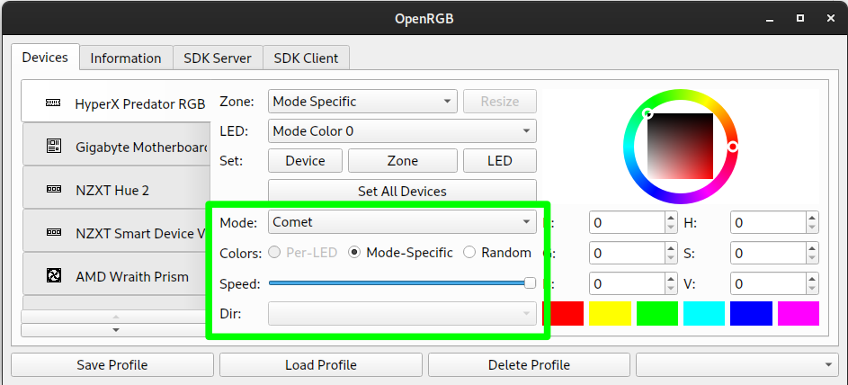
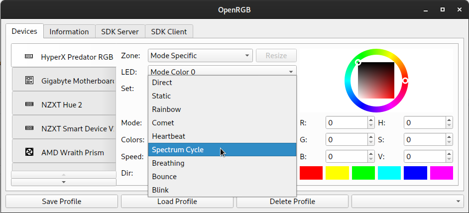
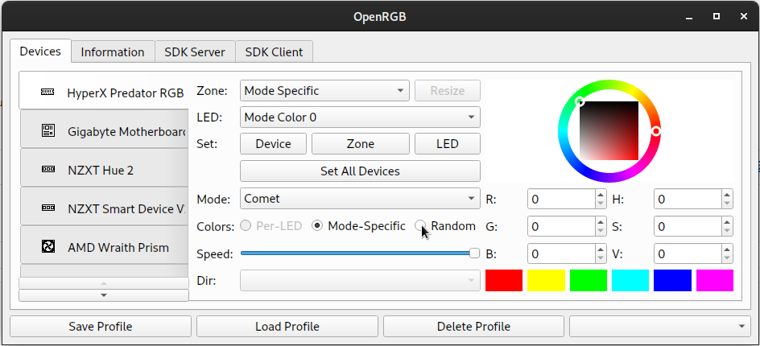
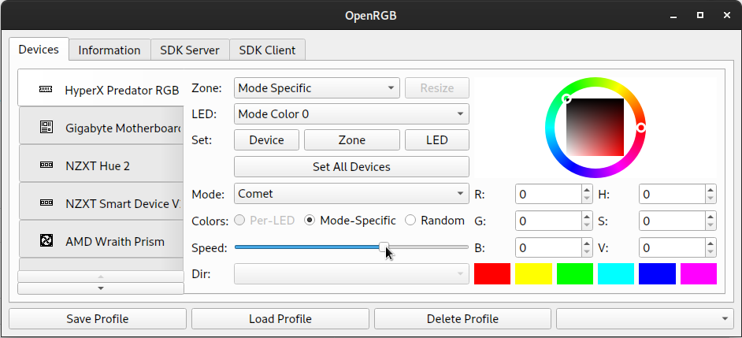
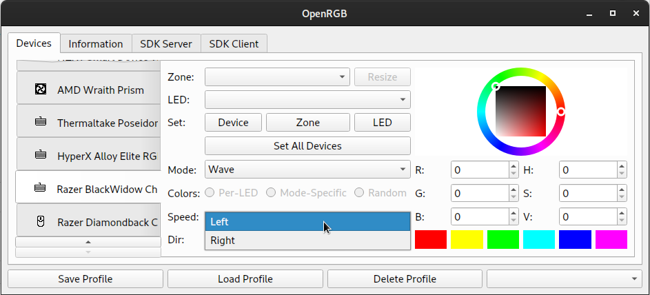

# Using OpenRGB

OpenRGB automatically tries to detect your RGB hardware when you start the application.  It may take some time to complete detection before the main window shows up.  If the main window is empty, it means OpenRGB could not detect your devices.  Follow the instructions in the README for setting up access to your devices.  On Windows, this usually means you need to run as administrator.  On Linux, it means you probably need to install the udev rules or install the kernel patch.

# Changing Modes

OpenRGB devices have one or more modes.  Modes represent different effects built into the RGB device's hardware.  Most devices have at least one mode that allows direct control of individual LEDs from software and one or more built-in effect modes (rainbows, spectrum cycles, etc).  Modes can have four different color configurations:

  * Per-LED Color - This color configuration allows you to set a specific color for each LED on the device independently
  * Mode-Specific Color - This color configuration allows you to set one or more colors, but the colors do not apply to individual LEDs.  An example would be a breathing mode that cycle between one or more preset colors.
  * Random Color - This color configuration does not have user-set colors.  An example would be a breathing mode that cycles through the spectrum or random colors each cycle.
  * None - This is usually the same as Random Color, but the mode doesn't have any other available color configurations.

The mode controls are shown in the screenshot below:

To change modes, click on the Mode selection box and select a different mode from the list.

You can change the color configuration using the three buttons in the Colors: group.  Only the available color configurations for the selected mode will be clickable.

If the mode supports it, you can adjust the speed slider to change the speed of the mode's effect.

If the mode supports it, you can adjust the direction of the mode by selecting a direction from the Direction selection box.

