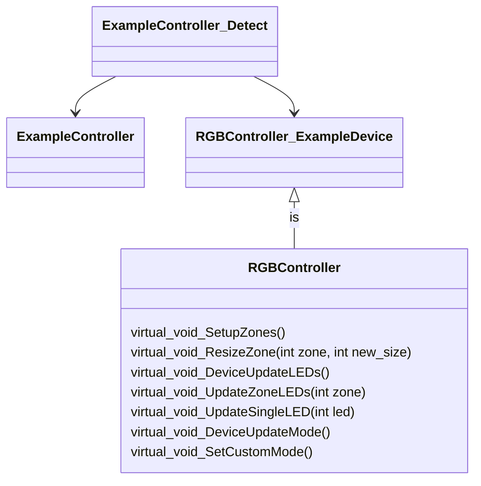

So, you've captured some packets, you think you understand the protocol of your device, you've written up the spec of the device for the wiki and now you're ready to code...

This guide will help you create a minimal OpenRGB device from a stub thru to sending a test packet.

[[_TOC_]]

# Overview
## The required files

In order to work with as many devices as possible, the OpenRGB API interface has to be standardised. That API is known as the `RGBController` and all known devices are an extension of `class RGBController`. This allows for consistent calls from the GUI, CLI and server code but does come with compromises not discussed here.

The extended class, `RGBController_ExampleDevice` is then required to implement 7 virtual functions [see diagram](#class-diagram) that act as a translation layer between the OpenRGB user interface and the actual `ExampleController`. The `RGBController_ExampleDevice` class will also enumerate all known attributes of the device to the UI. This includes the name, description, version, serial, in built modes of the device, zones, led count as well as initialising those attributes if required.

The `ExampleController` class is where all the previous hard work will pay off and it's in this class where all of the communication to the device occurs. You can think of this as the "Device Driver" and the OpenRGB API expects this class to set up the device ready for communication and return any state information to the controller class. Implementations of this class can vary as each manufacturer, transport layer, device type and device have different requirements and protocols. In the following steps I will be describing the steps for a USB device as it is the most common.

Finally there is an `ExampleController_Detect` class which is needed by the `Resource Manager`. The code in the detector class will do just that, detect if the device is present and call the `ExampleController` constructor for the device and then hand that new object to the `RGBController_ExampleDevice` constructor. This new `RGBController_ExampleDevice`, which is of `RGBController` class is then handed back to the `Resource Manager` in an state ready to receive RGB packets.

## Class Diagram
 


# Implementating a basic controller

When writing a new controller I normally implement the code by writing the detector class, then the driver class and finally the RGBController class. Realistically there's no "correct" way and will come down to comfort and preference.

## ExampleController_Detect

As previously mentioned, the detector class is just that. Code that detects, the presence of a device. If that device is found it will instantiate a new device object which is then parented to a new controller object. That controller object is then pushed onto the device stack in the `Resource Manager`.

If you're fortunate there may already be a detector class for the manufacturer VID (Vendor Identifier) that your new device was made by. That will mean you will just need to add the data for the new product to that detector and you can [skip this step](#examplecontroller).

### ExampleController_Detect stub
```c++
#include <hidapi/hidapi.h>
#include "Detector.h"
#include "RGBController.h"

#include "ExampleController.h"
#include "RGBController_ExampleController.h"
#define EXAMPLE_DETECTOR_NAME "Example Detector"


#define EXAMPLE_VID             0x1234

#define EXAMPLE_PID             0x9ABC

#define COUNT_EXAMPLE_DEVICES   (sizeof(example_pids) / sizeof(example_pids[ 0 ]))

enum
{
    EXAMPLE_PID       = 0,
    EXAMPLE_INTERFACE = 1,
    EXAMPLE_U         = 2,
    EXAMPLE_UP        = 3
};

static const unsigned int example_pids[][4] =
{  // PID,      Interface
    { EXAMPLE_DEVICE,        0x00,        0xCC,        0xFF00 }     //Example device details
};

/******************************************************************************************\
*                                                                                          *
*   DetectExampleControllers                                                                    *
*                                                                                          *
*       Tests the USB address to see if any Example Controllers exist there.                    *
*                                                                                          *
\******************************************************************************************/

void DetectExampleControllers(std::vector<RGBController*>& rgb_controllers)
{
    hid_device_info*    info;
    hid_device*         dev;
    unsigned short      tmpPID;

    if (hid_init() < 0)
    {
        return;
    }

    for(unsigned int dev_idx = 0; dev_idx < COUNT_EXAMPLE_DEVICES; dev_idx++)
    {
        dev = NULL;

        tmpPID = example_pids[dev_idx][EXAMPLE_PID];
        info = hid_enumerate(EXAMPLE_VID, tmpPID);

        while(info)
        {
            if((info->vendor_id        == EXAMPLE_VID)
#ifdef USE_HID_USAGE
            &&(info->product_id        == tmpPID)
            &&(info->usage             == example_pids[dev_idx][EXAMPLE_U])     //Usage and usage page required to get the correct interface
            &&(info->usage_page        == example_pids[dev_idx][EXAMPLE_UP]))
#else
            &&(info->interface_number  == example_pids[dev_idx][EXAMPLE_INTERFACE])   //Interface is only valid on Windows where there is > 1 interface
            &&(info->product_id        == tmpPID))
#endif
            {
                dev = hid_open_path(info->path);
                
                if (dev)
                {

                    ExampleController* controller = new ExampleController(dev, info->manufacturer_string, info->product_string, info->path);
                    RGBController_ExampleController* rgb_controller = new RGBController_ExampleController(controller);
                    rgb_controllers.push_back(rgb_controller);
                }
            }
            info = info->next;
        }
    }

    hid_free_enumeration(info);
}   /* DetectExampleControllers() */

REGISTER_DETECTOR(EXAMPLE_DETECTOR_NAME, DetectExampleControllers);
```

### ExampleController_Detect Breakdown

That stub itself should be straight forward but I'll go thru and add some context to each line starting at the top

The first 3 includes are all required by OpenRGB itself. The first reference `#include <hidapi/hidapi.h>` is a link to the HW library, in this case `libusb/hidapi1.0` which handles all the lower lever USB transport. You will only change this if you are implementing a non-USB device. `#include "Detector.h"` is a reference to the resource manager macros required to register this detector and `#include "RGBController.h"` is the base class for the `RGBController_ExampleController` which is needed when compiling.

The `#include "ExampleController.h"` and `#include "RGBController_ExampleController.h"` are references to the classes that you're about to write and `#define EXAMPLE_DETECTOR_NAME "Example Detector"` is the name used to register the detector with the resource manager.

Definitions for the VID and the PID(s) are next with `#define EXAMPLE_VID             0x1234` and `#define EXAMPLE_PID             0x9ABC`. The `#define COUNT_EXAMPLE_DEVICES   (sizeof(example_pids) / sizeof(example_pids[ 0 ]))` is declared for the convenience of use if a for loop.

You then have the list of devices, in the current example there is only one device listed. To add another it's as easy as adding another line with the correct details. The `enum` is just the indexes for the device details used later in the code.

```
enum
{
    EXAMPLE_PID       = 0,
    EXAMPLE_INTERFACE = 1,
    EXAMPLE_U         = 2,
    EXAMPLE_UP        = 3
};

static const unsigned int example_pids[][4] =
{  // PID,      Interface
    { EXAMPLE_DEVICE,        0x00,        0xCC,        0xFF00 }     //Example device details
};
```
After the comment you then have the real code starting with the entry point function called from the `Resource Manager` as well as a pointer to the device controller stack. There are then some temporary variables declared and we check to see if the USB hardware is available.

```c++
void DetectExampleControllers(std::vector<RGBController*>& rgb_controllers)
{
    hid_device_info*    info;
    hid_device*         dev;
    unsigned short      tmpPID;

    if (hid_init() < 0)
    {
        return;
    }
```
There is now a loop set up to iterate thru the device list and ensure that the device pointer `dev` is not pointing to a device. As the PID is used several times in the next steps we grab a reference to it and ask the hardware if there is a device connected with the VID and PID combination. If the device is found with `info = hid_enumerate(EXAMPLE_VID, tmpPID);` then `info` will not be null.

```c++
    for(unsigned int dev_idx = 0; dev_idx < COUNT_EXAMPLE_DEVICES; dev_idx++)
    {
        dev = NULL;

        tmpPID = example_pids[dev_idx][EXAMPLE_PID];
        info = hid_enumerate(EXAMPLE_VID, tmpPID);

```
We now have the code that actually detects the validity of the device. Even though we've managed to detect a device with the correct VID and PID it's still yet to be determined that you're speaking to the interface that handles the RGB controller packets. You will also note that there is a platform specific fix here because of the nuances in how operating systems handle USB differently. As a rule of thumb, Windows requires that we match the Usage (U) and Usage Page (UP) and Linux is only interested in which interface. In this way Windows is asking for more details about the interface as there is a one to many relationship between interface and usage.

```c++
        while(info)
        {
            if((info->vendor_id        == EXAMPLE_VID)
#ifdef USE_HID_USAGE
            &&(info->product_id        == tmpPID)
            &&(info->usage             == example_pids[dev_idx][EXAMPLE_U])     //Usage and usage page required to get the correct interface
            &&(info->usage_page        == example_pids[dev_idx][EXAMPLE_UP]))
#else
            &&(info->interface_number  == example_pids[dev_idx][EXAMPLE_INTERFACE])   //Interface is only valid on Windows where there is > 1 interface
            &&(info->product_id        == tmpPID))
#endif
```
So, if the device passes all these checks we're confident that we have the right device, it's connected to the system and it's able to now be opened `dev = hid_open_path(info->path);`. It's still possible that the device is in a state that can't be opened so one final check to see if that was successful before we create the `controller` object and the `RGBController` object. Presuming that your code has no problems with their constructors you can be confident these objects will be created and will finish with a device ready to be added to device stack in the `Resource Manager` with the line `rgb_controllers.push_back(rgb_controller);`.

```c++
                dev = hid_open_path(info->path);
                
                if (dev)
                {

                    ExampleController* controller = new ExampleController(dev, info->manufacturer_string, info->product_string, info->path);
                    RGBController_ExampleController* rgb_controller = new RGBController_ExampleController(controller);
                    rgb_controllers.push_back(rgb_controller);
                }
```

`info = info->next;` will then advance the hardware list to be checked, presuming that there are more than one. Once all hardware devices that matched the VID and PID, the for loop will continue on to the next PID in the `example_devices` list. Once all the devices in that list are checked the hardware pointer is removed from memory with `hid_free_enumeration(info);`. The last line in the code, `REGISTER_DETECTOR(EXAMPLE_DETECTOR_NAME, DetectExampleControllers);` is critical and necessary to register the detector with the `Resource Manager`. The 2 parameters that are passed to the `Resource Manager` are a unique string name for the detector, and the entry function to be executed.

### What to change

Great, you have a stub. You've copied and pasted it from above into your code locally and now you're ready to (re)compile OpenRGB. Oh, no wait a moment. You still need to change all the data to match that of the device you're trying to implement. Either that or you know what you're doing and it still didn't work. Here's a checklist of all the things to add or change.

## ExampleController

## RGBController_ExampleDevice

https://gitlab.com/CalcProgrammer1/OpenRGB/-/blob/master/RGBController/RGBController_Dummy.cpp

# Where next?

For further reading i would suggest looking at the in depth write up of the [OpenRGB API itself](https://gitlab.com/CalcProgrammer1/OpenRGB/-/wikis/The-RGBController-API).