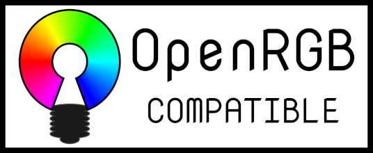

##  (formerly OpenAuraSDK)

One of the biggest complaints about RGB is the software ecosystem surrounding it.  Every manufacturer has their own app, their own brand, their own style.  If you want to mix and match devices, you end up with a ton of conflicting, functionally identical apps competing for your background resources.  On top of that, these apps are proprietary and Windows-only.  Some even require online accounts.  What if there was a way to control all of your RGB devices from a single app, on both Windows and Linux, without any nonsense?  That is what OpenRGB sets out to achieve.  One app to rule them all.

## Features

* Set colors and select effect modes for a wide variety of RGB hardware
* Save and load profiles
* Control lighting from third party software using the OpenRGB SDK
* Command line interface
* Connect multiple instances of OpenRGB to synchronize lighting across multiple PCs
* Can operate standalone or in a client/headless server configuration
* View device information
* No official/manufacturer software required

## WARNING!

This project provides a tool to probe the SMBus.  This is a potentially dangerous operation if you don't know what you're doing.  Exercise caution when clicking the Detect Devices or Dump Device buttons.  There have been reports of Gigabyte motherboards having serious issues (bricking the RGB or bricking the entire board) when dumping certain devices.  On the same lines, exercise the same caution when using the i2cdump and i2cdetect commands on Linux, as they perform the same functionality.  OpenRGB is not liable for damage caused by improper SMBus access.

As of now, only Gigabyte RGB Fusion 2.0 boards have been reported to have issues.

## Join Our Discord

https://discord.gg/AQwjJPY

## How-Tos

* [Windows Setup and Usage](OpenRGB-Windows-Setup-and-Usage)

## [Frequently Asked Questions](Frequently-Asked-Questions)

## Support OpenRGB

* OpenRGB is a project I created to solve a problem I had with the RGB ecosystem.  My goal isn't to make money off of this project.  That said, people have requested to donate, and donations allow me to buy more RGB stuff to reverse engineer.

* [Donate via PayPal](https://www.paypal.com/cgi-bin/webscr?cmd=_donations&business=4VPTFMD3G4QVG&item_name=OpenRGB+Development&currency_code=USD&source=url)

* [Become a Patron](https://www.patreon.com/CalcProgrammer1) (I'm not doing any Patreon-exclusive content, it's purely for donation)

* Donate via Bitcoin: 1N83YPu7btXYadPS1neB9zX7X1QTdpyZQ

## Supported Devices

### Motherboard RGB Systems

* [ASUS Aura (SMBus Variants)](ASUS-Aura-Overview)
    * ASUS PRIME X370-Pro
    * ASUS PRIME X470-Pro
    * ASUS PRIME X399-A
    * ASUS PRIME B450M-Gaming
    * ASUS PRIME Z270-A
    * ASUS PRIME Z370-A
    * ASUS ROG Crosshair VI Hero
    * ASUS ROG STRIX X399-E Gaming
    * ASUS ROG Strix B450-F Gaming
    * ASUS ROG Strix Z370-E
    * ASUS TUF B450 Plus Gaming
* [ASUS Aura (USB Variants)](ASUS Aura USB)
    * [ASUS Aura Addressable Headers](ASUS-Aura-Addressable-Header)
    * ASUS X570 Motherboards
* [Gigabyte Aorus RGB Fusion 1.0](Gigabyte-RGB-Fusion-1.0)
    * Gigabyte Aorus X370 Gaming 5
* Gigabyte Aorus RGB Fusion 2.0 (SMBus) (EXPERIMENTAL)
    * Disabled by default because we don't have appropriate detection code yet, and it has an address conflict that could brick Z390 Aorus boards.
    * Uncomment DetectRGBFusion2SMBusControllers call in OpenRGB.cpp if you wish to use.
    * ONLY run this on supported motherboards!!!!!
* Gigabyte Aorus RGB Fusion 2.0 (USB)
    * Gigabyte X570 Aorus Extreme
    * Gigabyte X570 Aorus Master
    * Gigabyte X570 Aorus Pro
    * Gigabyte X570 Gaming X
    * Gigabyte X570 I Aorus Pro Wifi
    * Gigabyte TRX40 Aorus Master
    * Gigabyte Z390 Aorus Ultra
* [ASRock Polychrome RGB](ASRock-Polychrome-RGB)
    * ASRock Steel Legend B450M
    * ASRock Fatal1ty B350 Gaming-ITX/ac
    * ASRock B450M/ac
    * ASRock X570 Taichi
* [MSI-RGB](MSI-RGB)
* [MSI Mystic Light](MSI-Mystic-Light)

### RGB RAM Modules

* [ASUS Aura Based](ASUS-Aura-Overview)
    * G.Skill Trident Z RGB
    * G.Skill Trident Z Neo
    * G.Skill Trident Z Royal
    * Geil Super Luce
    * Team T-Force Delta RGB
    * OLOy WarHawk RGB
    * ADATA SPECTRIX RGB
    * Thermaltake TOUGHRAM RGB
* [Corsair Vengeance RGB](Corsair-Vengeance-RGB)
* [Corsair Vengeance Pro RGB](Corsair-Vengeance-Pro-RGB)
* [HyperX RGB Memory](HyperX-Predator-RGB)
    * HyperX Predator RGB
    * HyperX Fury RGB
* [Patriot Viper RGB](Patriot-Viper-RGB)
* [Crucial Ballistix RGB](Crucial-Ballistix-RGB)
* [Gigabyte Aorus RGB RAM (Partial support)](Gigabyte-RGB-Fusion-2.0-DRAM)

### Graphics Cards

* [ASUS Aura GPUs](Asus-Aura-GPU)
* [Gigabyte Aorus RGB Fusion GPUs](Gigabyte-RGB-Fusion-GPU)
    * Gigabyte Aorus GTX1080Ti Xtreme Waterforce WB

### LED Strip and Fan Controllers

* [ASUS ROG Aura Terminal](ASUS-Aura-Addressable-Header)
* [NZXT Hue+](NZXT-Hue-Plus)
* [NZXT Hue 2 Devices](NZXT-Hue-2)
    * NZXT Hue 2
    * NZXT Hue 2 Ambient
    * NZXT Smart Device V2
    * NZXT RGB & Fan Controller
* [Corsair Lighting Node Devices](Corsair-Lighting-Node-Devices)
    * Corsair Lighting Node Core
    * Corsair Lighting Node Pro
    * Corsair Commander Pro
    * Corsair LS100 Lighting Kit
    * Corsair 1000D Obsidian
    * Corsair SPEC OMEGA RGB
    * [Corsair Lighting Protocol (Arduino)](https://github.com/Legion2/CorsairLightingProtocol)
* [Keyboard Visualizer Arduino LED strips](Keyboard-Visualizer-LED-Strips)
* [E1.31 Streaming ACN Protocol](E1.31)
    * [ESPixelStick](https://github.com/forkineye/ESPixelStick)
    * [WLED](https://github.com/Aircoookie/WLED)
* [Thermaltake Riing Plus](Thermaltake-Riing)

### Fans and Coolers

* [AMD Wraith Prism](AMD-Wraith-Prism)
* [NZXT Kraken X42/X52/X62/X72](NZXT-Kraken)

### Keyboards

* [ASUS ROG Aura Core Laptops](ASUS-Aura-Core)
    * ASUS ROG Zephyrus M GM501GM
* [Corsair RGB Keyboards](Corsair-Peripheral-Protocol)
    * Corsair K65 RGB
    * Corsair K65 Lux RGB
    * Corsair K65 RGB Rapidfire
    * Corsair K68 RGB
    * Corsair K70 RGB
    * Corsair K70 Lux RGB
    * Corsair K70 RGB Rapidfire
    * Corsair K70 RGB MK.2
    * Corsair K70 RGB MK.2 SE
    * Corsair K70 RGB MK.2 Low Profile
    * Corsair K95 RGB
    * Corsair K95 RGB Platinum
    * Corsair Strafe
    * Corsair Strafe MK.2
* Ducky RGB Keyboards
    * Ducky Shine 7
    * Ducky One 2
    * Ducky One 2 TKL
* [HyperX RGB Keyboards](HyperX-Alloy-Elite)
    * HyperX Alloy Elite
* [Logitech RGB Keyboards](Logitech-Keyboards)
    * Logitech G512
    * Logitech G810 Orion Spectrum
* [MSI Steelseries 3-Zone Keyboard](MSI-3-Zone-Keyboard)
    * MSI GS63VR
* [Redragon Keyboards (and compatibles)](Redragon-K556-Devarajas)
    * Redragon K550 Yama
    * Redragon K552 Kumara
    * Redragon K556 Devarajas
    * Tecware Phantom Elite
    * Warrior Kane TC235
* [TTEsports Poseidon Z RGB](Thermaltake-Poseidon-Z-RGB)

### Mice

* [Corsair Mice](Corsair-Peripheral-Protocol)
    * Corsair M65 RGB PRO
    * Corsair M65 RGB Elite
* Glorious Model O
* [Logitech Mice](Logitech-G203)
    * Logitech G203 Prodigy
    * Logitech G403 Prodigy
* [Redragon Mice](Redragon-M711-Cobra)
    * Redragon M711 Cobra
    * Redragon M715 Dagger
* SteelSeries Rival 100 and 300 series

### Mousemats

* Corsair MM800 Polaris

### Other

* Corsair ST100 Headset Stand

### Other projects integrated

* [OpenRazer](https://github.com/openrazer/openrazer) / [OpenRazer-Win32](https://github.com/CalcProgrammer1/openrazer-win32)
    * Keyboards
        * Razer BlackWidow 2019
        * Razer BlackWidow Chroma
        * Razer BlackWidow Chroma Overwatch
        * Razer BlackWidow Chroma Tournament Edition
        * Razer BlackWidow Chroma V2
        * Razer BlackWidow Elite
        * Razer BlackWidow X Chroma
        * Razer BlackWidow X Tournament Edition Chroma
        * Razer Cynosa Chroma
        * Razer DeathStalker Chroma
        * Razer Ornata Chroma
        * Razer Huntsman
        * Razer Huntsman Elite
        * Razer Huntsman Tournament Edition
    * Mice
        * Razer Abyssus Elite DVa Edition
        * Razer Abyssus Essential
        * Razer Basilisk
        * Razer DeathAdder Chroma
        * Razer DeathAdder Elite
        * Razer Diamondback Chroma
        * Razer Lancehead Tournament Edition
        * Razer Mamba 2012
        * Razer Mamba Chroma
        * Razer Mamba Elite
        * Razer Mamba Tournament Edition
        * Razer Naga Chroma
        * Razer Naga Epic Chroma (*)
        * Razer Naga Hex V2
        * Razer Naga Trinity
        * Razer Viper Ultimate
    * Laptops
        * Razer Blade Stealth
        * Razer Blade Stealth (Late 2016)
        * Razer Blade Stealth (Mid 2017)
        * Razer Blade Stealth (Late 2017)
        * Razer Blade Stealth (2019)
        * Razer Blade Stealth (Late 2019)
        * Razer Blade (Late 2016)
        * Razer Blade (QHD)
        * Razer Blade 15 (2018)
        * Razer Blade 15 (2018) Mercury
        * Razer Blade 15 (2018) Base Model
        * Razer Blade 15 (2019) Advanced
        * Razer Blade 15 (Mid 2019) Mercury
        * Razer Blade 15 (Mid 2019) Base Model
        * Razer Blade 15 Studio Edition (2019)
        * Razer Blade Pro (Late 2016)
        * Razer Blade Pro (2017)
        * Razer Blade Pro FullHD (2017)
        * Razer Blade Pro 17 (2019)
        * Razer Blade Pro (Late 2019)
    * Headsets
        * Razer Kraken 7.1 Chroma
        * Razer Kraken V2 Chroma
        * Razer Tiamat 7.1 V2 (*)
    * Mousemats
        * Razer Firefly
        * Razer Goliathus Extended Chroma
    * Speakers
        * Razer Nommo Chroma
        * Razer Nommo Pro
    * Accessories
        * Razer Base Station Chroma
        * Razer Chroma HDK
        * Razer Core
        * Razer Mug Holder Chroma

(*) - Device not supported in upstream OpenRazer and requires a custom build.

* Faustus (ASUS TUF Laptop Keyboards) (Linux)

## History of OpenRGB

OpenRGB is a continuation of OpenAuraSDK, which itself was created out of reverse engineering work done on the Keyboard Visualizer project.  For a complete history of the RGB projects that led to OpenRGB's creation, see the [History page](History-of-OpenRGB).