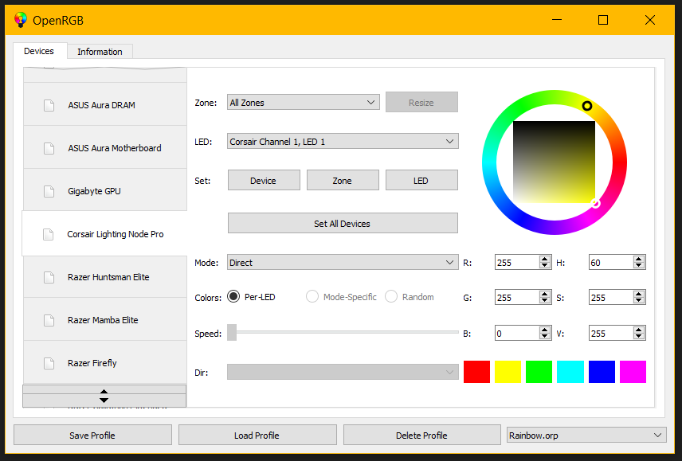

##  (formerly OpenAuraSDK)

One of the biggest complaints about RGB is the software ecosystem surrounding it.  Every manufacturer has their own app, their own brand, their own style.  If you want to mix and match devices, you end up with a ton of conflicting, functionally identical apps competing for your background resources.  On top of that, these apps are proprietary and Windows-only.  Some even require online accounts.  What if there was a way to control all of your RGB devices from a single app, on both Windows and Linux, without any nonsense?  That is what OpenRGB sets out to achieve.  One app to rule them all.

OpenRGB is still in its early stages and already supports quite a few products.  I'm always on the lookout for good deals on more popular RGB devices to add support for.

## Join Our Discord

https://discord.gg/AQwjJPY

## Motherboard RGB Systems

* [ASUS Aura (SMBus Variants)](ASUS-Aura-Overview)
    * ASUS PRIME X370-Pro
    * ASUS PRIME X470-Pro
    * ASUS PRIME X399-A
    * ASUS PRIME B450M-Gaming
    * ASUS PRIME Z270-A
    * ASUS PRIME Z370-A
    * ASUS ROG Crosshair VI Hero
    * ASUS ROG STRIX X399-E Gaming
    * ASUS ROG Strix B450-F Gaming
    * ASUS ROG Strix Z370-E
    * ASUS TUF B450 Plus Gaming

* ASUS Aura Addressable Headers (USB)

* [Gigabyte Aorus RGB Fusion 1.0](Gigabyte-RGB-Fusion-1.0)
    * Gigabyte Aorus X370 Gaming 5

* Gigabyte Aorus RGB Fusion 2.0 (USB)
    * Gigabyte X570 Aorus Extreme
    * Gigabyte X570 Aorus Master
    * Gigabyte X570 Aorus Pro
    * Gigabyte X570 Gaming X
    * Gigabyte X570 I Aorus Pro Wifi
    * Gigabyte TRX40 Aorus Master

* [ASRock Polychrome RGB](ASRock-Polychrome-RGB)
    * ASRock Steel Legend B450M
    * ASRock Fatal1ty B350 Gaming-ITX/ac
    * ASRock B450M/ac
    * ASRock X570 Taichi

* MSI-RGB

* MSI Mystic Light

## RGB RAM Modules

* [ASUS Aura Based](ASUS-Aura-Overview)
    * G.Skill Trident Z RGB
    * G.Skill Trident Z Neo
    * G.Skill Trident Z Royal
    * Geil Super Luce
    * Team T-Force Delta RGB
    * OLOy WarHawk RGB
    * ADATA SPECTRIX RGB

* [Corsair Vengeance RGB](Corsair-Vengeance-RGB)

* [Corsair Vengeance Pro RGB](Corsair-Vengeance-Pro-RGB)

* [HyperX RGB Memory](HyperX-Predator-RGB)
    * HyperX Predator RGB
    * HyperX Fury RGB

* [Patriot Viper RGB](Patriot-Viper-RGB)

* [Crucial Ballistix RGB](Crucial-Ballistix-RGB)

## Graphics Cards

* [ASUS Aura GPUs](Asus-Aura-GPU)

* [Gigabyte Aorus RGB Fusion GPUs](Gigabyte-RGB-Fusion-GPU)

## LED Strip and Fan Controllers

* [NZXT Hue+](NZXT-Hue-Plus)

* [NZXT Hue 2](NZXT-Hue-2) and NZXT Smart Device V2

* [Corsair Lighting Node Core](Corsair-Lighting-Node-Pro)

* [Corsair Lighting Node Pro](Corsair-Lighting-Node-Pro)

* [Corsair Commander Pro](Corsair-Lighting-Node-Pro)

* [Keyboard Visualizer Arduino LED strips](Keyboard-Visualizer-LED-Strips)

* [E1.31 Streaming ACN Protocol](E1.31)

* [Thermaltake Riing Plus](Thermaltake-Riing)

## Fans and Coolers

* [AMD Wraith Prism](AMD-Wraith-Prism)

* NZXT Kraken X42/X52/X62/X72

## Keyboards

* [MSI Steelseries 3-Zone Keyboard](MSI-3-Zone-Keyboard)

* [TTEsports Poseidon Z RGB](Thermaltake-Poseidon-Z-RGB)

* [Corsair K70 RGB](https://github.com/ckb-next/ckb-next/wiki/Corsair-Protocol)

* [HyperX Alloy Elite](HyperX-Alloy-Elite)

* [Redragon K556 Devarajas](Redragon-K556-Devarajas)

## Mice

* Corsair M65

* [Redragon M711 Cobra](Redragon-M711-Cobra)

## Mousemats

* Corsair MM800 Polaris

## Other projects integrated

* [OpenRazer](https://github.com/openrazer/openrazer) / [OpenRazer-Win32](https://github.com/CalcProgrammer1/openrazer-win32)
    * Keyboards
        * Razer BlackWidow Chroma
        * Razer BlackWidow Chroma Tournament Edition
        * Razer Ornata Chroma
        * Razer Huntsman Elite

    * Mice
        * Razer Mamba Tournament Edition
        * Razer Diamondback

    * Laptops
        * Razer Blade Stealth
        * Razer Blade Pro (2017)

    * Headsets
        * Razer Kraken 7.1 Chroma
        * Razer Kraken V2 Chroma

    * Mousemats
        * Razer Firefly
        * Razer Goliathus Extended Chroma

    * Accessories
        * Razer Mug Holder Chroma
        * Razer Chroma HDK
        * Razer Core

* Faustus (ASUS TUF Laptop Keyboards) (Linux)